# Ciclo de vida real de un pedido

Reconstruido a partir del código y de la base de datos en vivo. **No** es el flujo ideal: es lo que el sistema hace hoy, con sus atajos y huecos. Cada etapa enlaza al workflow detallado.

> Un **pedido** en Alcohn AI es una fila de `ordenes` (la "orden") con uno o más **ítems** en `sellos` (aunque se llamen "sellos", un ítem puede ser un abecedario, un soldador, etc.). Ver [glosario](../15-glossary/README.md).

## 1. Vista general

```mermaid
flowchart LR
  A0["Contacto / consulta<br/>(WhatsApp, IG, FB, mail, web)"] --> A1
  M["Mockup<br/>(generador app o web)"] -.opcional.-> A1
  A1{"Origen"}
  A1 -->|Manual| B1["Alta en Pedidos<br/>(seña registrada)"]
  A1 -->|Tienda web| B2["Checkout web<br/>orden oculta hasta pago"]
  B2 -->|"pago confirmado<br/>(Openpay o comprobante)"| B3["confirm-web-order<br/>crea sellos"]
  B1 --> C["Diseño<br/>archivo base"]
  B3 --> C
  C --> D["Vectorización<br/>SVG + medida de fabricación"]
  D --> E["Programa CNC<br/>(máquina C / G / XL)"]
  E --> F["Aspire + máquina<br/>(fuera de Alcohn AI)"]
  F --> G["Hecho"]
  G --> H["Foto del sello<br/>→ WhatsApp con restante"]
  H --> I{"Cobro del restante"}
  I -->|"paga"| J["Transferido"]
  I -->|"10 días sin pagar"| K["Deudor (automático)"]
  J --> L{"Empresa de envío"}
  L -->|Correo Argentino| L1["Datos de envío → MiCorreo<br/>→ Etiqueta lista"]
  L -->|Andreani| L2["Link de envío pagado por el cliente<br/>→ etiqueta sincronizada"]
  L -->|Vía Cargo / Retiro| L3["Sin automatización"]
  L1 --> N["Despachado<br/>(seguimiento cargado)"]
  L2 --> N
  N --> O["WhatsApp con seguimiento<br/>→ Seguimiento Enviado"]
  O --> P["Stock descontado<br/>pedido cerrado"]
  P -.2 meses después.-> Q["Mensaje de recompra<br/>(automático)"]
```

## 2. Etapas

### 2.1 Origen del pedido — [WF-01](../03-workflows/WF-01-alta-manual-de-pedido.md), [WF-02](../03-workflows/WF-02-pedido-web.md), [WF-09](../03-workflows/WF-09-mockup-y-contacto-comercial.md)

- ✅ **Manual**: un usuario completa el asistente de 3 pasos en Pedidos (cliente → diseños → resumen). Se crea `ordenes` con `estado_orden='Señado'` y un `sellos` por diseño. Salvo que se marque "no enviar confirmación", se manda WhatsApp `pedido_registrado`.
- ✅ **Web**: la tienda web crea `ordenes.origen='Web'` con `estado_pago_web`. Mientras no esté `'pagado'` la orden **no aparece** en Pedidos, Producción ni Envíos. Al pasar a `'pagado'` (Openpay en la web, o validación manual del comprobante en Comercial Web) un trigger llama a `confirm-web-order`, que crea/normaliza los sellos a partir del carrito y manda `pedido_registrado`.
- ❓ La conversación de venta (precio, diseño, seña) ocurre **fuera de Alcohn AI** (WhatsApp, Instagram, etc.). Alcohn AI registra el resultado. → [FR-01](../10-operational-boundaries/README.md#fr-01).

### 2.2 Diseño y vector — [WF-03](../03-workflows/WF-03-diseno-y-vectorizacion.md)

- ✅ Cada ítem tiene un **archivo base** (imagen del cliente, bucket `base`) y opcionalmente un **vector** (bucket `vector`, guardado en `archivo_vector_preview`).
- ✅ El vector se obtiene en la página **Vectorización** (Vectorizer.AI, varias imágenes por "hoja" para ahorrar créditos) o se sube a mano (Pedidos/Producción). Al subir un SVG se calcula la **medida de fabricación** y, si hay desvío, se pide confirmarla.
- ✅ `estado_vectorizacion`: `BASE` → `VECTORIZADO` (o `EN_PROCESO`/`ERROR` en el flujo automático, hoy desactivado).

### 2.3 Programa de producción — [WF-04](../03-workflows/WF-04-programa-y-fabricacion-cnc.md)

- ✅ Solo ítems tipo `SELLO`, vectorizados y en `Sin Hacer`/`Rehacer` (o el legado `Prioridad`) pueden entrar a un **programa**. El programa pertenece a una **máquina** (`C` Chica, `G` Grande, `XL`; `ABC` existe pero no genera paquete).
- ✅ Al entrar, el sello pasa a `'Programado'`, se le asigna máquina y `estado_aspire='Aspire C|G|XL'`.
- ✅ El programa se lleva a **Vectric Aspire** (ZIP descargado o, preferentemente, el gadget Lua que lo baja directo). El gadget reporta qué sellos quedaron y sube el `.crv3d` → el programa pasa a **LISTO** ("Listo para Fabricar").
- ❓ Qué pasa entre el `.crv3d` y el sello mecanizado (guardar trayectorias, cargar la máquina, colocar planchuelas, mecanizar, cortar, terminar) **no está en Alcohn AI**. → [FR-04](../10-operational-boundaries/README.md#fr-04).

### 2.4 Fabricado — [WF-04](../03-workflows/WF-04-programa-y-fabricacion-cnc.md), [WF-08](../03-workflows/WF-08-rehacer.md)

- ✅ Un usuario marca `Haciendo` y luego `Hecho` (desde el menú del programa, arrastrando el programa a "Terminados", o por sello en Producción/Pedidos). `Hecho` dispara: registro de consumo de bronce, recálculo de `tipo_planchuela`, notificación a Ventas ("sellos terminados").
- ✅ Si algo sale mal: **Rehacer** con motivo obligatorio (y cobro adicional opcional). El sello vuelve a la cola como prioritario y, si ya se había despachado, la orden vuelve a `Sin envio`.

### 2.5 Foto y cobro — [WF-05](../03-workflows/WF-05-foto-y-cobro.md), [WF-12](../03-workflows/WF-12-deudores.md)

- ✅ Se sube la **foto del sello terminado** (celda Foto o "Subir fotos"). Si la venta estaba `Señado`, pasa a `'Foto'` ("Foto enviada"). Un **trigger** manda por WhatsApp la foto con el **restante a pagar** (con o sin costo de envío, o el total si es el último ítem de la orden) y, si el envío es Andreani, el **link de envío**.
- ❓ El cliente paga por fuera (transferencia). → [FR-06](../10-operational-boundaries/README.md#fr-06).
- ✅ La venta pasa a `'Transferido'` por tres caminos: a mano en la celda Venta, **implícitamente al guardar datos de envío** (Envíos) o al **cargar el seguimiento de Correo** (Pedidos).
- ✅ Cron diario: si **todos** los ítems de una orden llevan ≥10 días en `'Foto'`, la orden y sus ítems pasan a `'Deudor'` y se notifica a Ventas.

### 2.6 Envío — [WF-06](../03-workflows/WF-06-envio-correo-argentino.md), [WF-07](../03-workflows/WF-07-envio-andreani.md)

- ✅ Una orden aparece en Envíos cuando **todos** sus ítems están `Hecho`, no es `Deudor`, no está en `Seguimiento Enviado` y la empresa no es "Retiro en persona".
- ✅ **Correo Argentino**: se cargan/validan los datos contra el padrón `correo_sucursales`; al guardar, la orden pasa a Transferido y un **worker** sube el CSV a MiCorreo y paga la etiqueta → `Etiqueta Lista` (o `Error de Etiqueta`). Luego se sube el PDF de etiquetas en "Cargar seguimientos": se asignan los números de seguimiento y la orden queda **`Despachado`**.
- ✅ **Andreani**: el cliente completa y **paga** el envío en un link de Andreani que Alcohn AI le mandó. Un worker trae las etiquetas del portal, se asignan a la orden (`Etiqueta Lista`) y, cuando el portal deja de decir "Pendiente de ingreso", la orden pasa a **`Despachado`**.
- ❓ Imprimir, embalar, llevar al correo o entregar al transportista ocurre fuera de Alcohn AI. → [FR-07](../10-operational-boundaries/README.md#fr-07), [FR-08](../10-operational-boundaries/README.md#fr-08).

### 2.7 Cierre — [WF-06](../03-workflows/WF-06-envio-correo-argentino.md)

- ✅ `Despachado` + número de seguimiento → trigger manda WhatsApp `pedido_enviado`. Si el bot confirma el envío, la orden pasa **sola** a `'Seguimiento Enviado'`, se sella `seguimiento_enviado_at` y se **descuentan los insumos** del stock.
- ✅ Una orden se considera **cerrada** cuando todos los ítems están `Hecho` y el envío está `Despachado` o `Seguimiento Enviado` (`src/lib/utils/orderLifecycle.ts`).

### 2.8 Post-venta — [WF-10](../03-workflows/WF-10-recompra.md)

- ✅ Días hábiles, 15:26 UTC (🔶 12:26 hora Argentina): hasta 10 clientes con **una sola orden** `Transferido` + `Seguimiento Enviado` de hace ≥2 meses reciben un WhatsApp de recompra (una única vez por cliente).

## 3. Lo que este ciclo NO muestra

- **Retiro en persona** y **Vía Cargo** no tienen flujo automatizado; cómo se entregan es desconocido → [Q-ENV-004](../14-open-questions/envios.md#q-env-004).
- Los estados pueden cambiarse a mano en casi cualquier orden desde la UI; la base de datos **no impide** transiciones "ilegales" (ver [06-state-machines](../06-state-machines/README.md)).
- Cerca del 72 % de las órdenes en la base (2.645 de 3.676) no tienen empresa de envío cargada; 🔶 en su mayoría son históricas importadas desde planillas (`scripts/import-*.mjs`). Sus combinaciones de estados no siguen este ciclo (p. ej. 2.048 órdenes con `estado_orden='Seguimiento Enviado'`, un valor de envío guardado en el campo de venta). Ver [audits/inconsistencias.md](../audits/inconsistencias.md).
