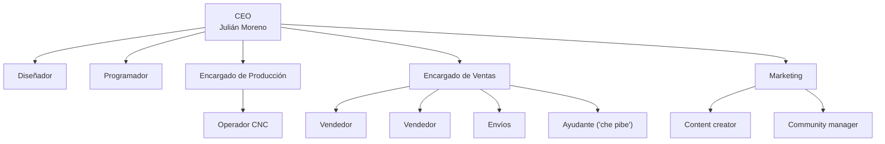

# La empresa: Alcohn

Contexto de negocio para personas y agentes: quiénes somos, qué vendemos, a quién, contra quién competimos, cómo queremos diferenciarnos y hacia dónde vamos. Es el documento a leer **antes** que cualquier otro cuando la tarea es mejorar un proceso, proponer una funcionalidad o hablar en nombre de la marca.

## Cómo leer este documento

Mezcla dos fuentes de distinta antigüedad. Cada bloque dice de cuál viene:

| Marca | Fuente | Antigüedad | Cuánto confiar |
|---|---|---|---|
| **[Visión]** | Página de Notion "La Empresa" y subpáginas (Estrategia, Táctica, Aplicación de Táctica, Plan de Acción, Projects), escritas por Julián Moreno | Mayormente 2023–2024; "Regalos" y "Estructura Empleados Ideal" son de enero–febrero 2026 | Es la **intención** del dueño. El dueño avisó que es vieja, de cuando la empresa era más chica, y que puede no estar del todo vigente |
| **[Hoy]** | Respuestas del equipo (2026-09-28), código y base de datos de Alcohn AI | Septiembre 2026 | Es la **realidad actual** |

Cuando la visión y la realidad no coinciden, no se asume cuál está bien: queda como pregunta en la [sección 11](#11-preguntas-para-el-dueño) y en [14-open-questions/empresa.md](../14-open-questions/empresa.md).

---

## 0. La visión hoy (dicha por el dueño, 2026-09-28)

> Quiero que Alcohn sea **un lugar donde la gente quiera trabajar**. Ese es mi sueño. Me gustaría que Alcohn se transforme en una **fábrica**, siempre desde una visión del **diseño y la estética**, la **modernidad y la tecnología**, el **avance y la vanguardia**, la **innovación**.

Esta es la visión vigente y **tiene prioridad** sobre la de Notion (sección 1). Agrega dos cosas que el documento de Notion casi no desarrolla:

- **Las personas que trabajan en Alcohn** como objetivo en sí mismo, no solo el cliente. En Notion, "Estrategia de empleados" figura "en curso" pero sin contenido.
- **Escala**: pasar de taller a **fábrica**, sin perder el diseño, la estética y la tecnología como identidad.

Qué significa en concreto (respuestas del dueño, 2026-09-29):

- **Un lugar donde la gente quiera trabajar** ([Q-EMP-009](../14-open-questions/empresa.md#q-emp-009)): que **la gente joven aspire a trabajar acá**. Por las condiciones: un lugar **relajado**, al que uno **disfruta venir**, con **gran ambiente**; donde se **premie la creatividad y la innovación**; con **trabajo en equipo**, donde **todos son parte y cada uno importa**; donde la gente **aprenda y se desarrolle**; con **flexibilidad**; y con **orgullo por lo que hacemos**. (El dueño aclara que todavía no lo tiene del todo definido, "pero va por ahí".)
- **Una fábrica** ([Q-EMP-010](../14-open-questions/empresa.md#q-emp-010)): un lugar **más grande**, con **más máquinas**, **más volumen** y **más empleados**, siempre con esos valores como faro. **No una fábrica gris, sino una fábrica con carácter de estudio de diseño y creatividad.**

Para agentes: una mejora de proceso o de la app se evalúa también por **cómo cambia el trabajo diario del equipo** (menos tareas repetitivas, menos apagar incendios, roles más claros, orgullo por lo que se fabrica), no solo por el cliente o la facturación.

## 1. Identidad

**[Hoy]** Vigente, definido con el dueño el 2026-09-29 ([Q-EMP-001](../14-open-questions/empresa.md#q-emp-001)). Parte de Notion y le suma la mirada interna de la sección 0. La redacción de visión y misión es una propuesta armada a partir de sus respuestas; el dueño puede pulir las palabras.

- **Nombre**: ALCOHN.
- **Frase guía**: *"Detrás de cada sello, hay una persona con sueños y esperanza."*
- **Descripción**: empresa CNC especializada en **sellos de bronce personalizados**, fabricados con tecnología de alta precisión, con foco en un servicio personalizado.
- **Desde**: 2019 ("Acompañando profesionales desde 2019").
- **Dónde**: **Mar del Plata**. Oficina y taller en **Alberti 1254**.
- **Horario**: se comunica **de 9 a 16 h**. El equipo tiene **horario flexible**: cada uno cumple su jornada (en general 8 horas) en el horario que quiera.
- **Visión**: ser la **fábrica-estudio de referencia** para emprendedores, artesanos y PyMEs, que los ayude a crecer, profesionalizarse y cumplir sus metas, y **un lugar donde la gente joven aspire a trabajar**, con el diseño, la tecnología y la innovación como sello propio.
- **Misión**: fabricar productos de alta calidad para personalizar el trabajo de nuestros clientes, comprometidos con ellos y buscando relaciones duraderas, **con un equipo que crece, aprende y se enorgullece de lo que hace**; guiados por la innovación, la creatividad y la mejora continua.
- **Valores**: Calidad, Creatividad, Cercanía, Adaptabilidad, Innovación, **Diseño y estética**, **Vanguardia y tecnología**, **Orgullo por lo que hacemos** y **Equipo** (los cuatro últimos, sumados en 2026).
- **Cliente**: los perfiles de la [sección 3](#3-clientes) **siguen vigentes**.

Versión original de Notion (2023–2024)

- Visión: transformarnos en una empresa referente para emprendedores, artesanos y PyMEs, que pueda ayudarlos a crecer, mejorar y cumplir sus metas.
- Misión: dedicarnos a la fabricación de productos de alta calidad para la personalización de los trabajos de nuestros clientes. Comprometidos con ellos y a formar relaciones duraderas con ellos. Guiados por la innovación, la creatividad y la mejora continua.
- Valores: Calidad, Creatividad, Cercanía, Adaptabilidad e Innovación.

### La historia que contamos

**Sigue siendo el mensaje central de la marca** (confirmado 2026-09-29).

> *Transformamos a trabajadores de la madera y el cuero en profesionales del oficio, revalorizándolos a ellos y a su trabajo.*

El sello no se vende como un pedazo de bronce ni como una herramienta: es **el medio para contar la historia** de quien lo usa (el que arranca en el oficio, el que tiene veinte años de experiencia, la que cumple el sueño de tener su marca de marroquinería, el hobbista que trabaja para su familia). Alcohn es "el lugar donde dan el salto a la profesionalización" y dejan de ser uno más del montón.

Frases de marca: *Una forma de contar historias* · *Más que una herramienta* · *Sellos para profesionales* · *Acompañando profesionales desde 2019*.

Estética buscada: un estudio moderno y de diseño que combina tecnología con la tradición **grunge, kraft y vintage** propia de los clientes.

## 2. Qué vendemos

**[Hoy]** (detalle técnico en [01-product](../01-product/README.md)):

| Producto | Qué es |
|---|---|
| **Sello de bronce personalizado** | El producto central (≈ 98 % de los ítems). Tipos: **Clásico** (grabado de 1,7 mm, el estándar), **3 mm** (más profundo), **Lacre** (cabezal torneado), **Alimento** (3 mm y cortado con la forma del diseño) |
| **Abecedario** | Letras individuales + contenedor. Único ítem que no es un sello |
| **Soldador adaptado** (100 W / 200 W) | Soldador eléctrico al que se le corta la punta y se le hace rosca M6 para enroscar el sello y marcar a fuego |
| **Mango de golpe** | Para marcar a presión/golpe (viene hecho) |
| **Base para remachadora** | Viene hecha |

Cada sello sale armado con varilla, tuerca, prisionero y mango (lo arma logística al despachar).

**[Visión]** El catálogo imaginado era más amplio. Estructura de producto en Notion:

- **Sellos**: personalizados y **estándar** (diseños patrios argentinos, fútbol).
- **Complementos (upsell)**: mango de golpe, calentador eléctrico.
- **Máquinas (futuro)**: máquina de estampar.
- Lista de productos de Alcohn: sellos personalizados de marca, **clisés estándar**, **rodillos estándar de trama**, **chapas personalizadas**, **pins 2D personalizados**, **pins 3D estándar**, **diges mates 2D y 3D**, **abecedarios premium**, **stickers de bronce**, **sellos lacre**.
- Agrupación por rubro: madera (sello + calentador), cuero (sello + mango de golpe + calentador + máquina), cerámica (sello + ¿mango especial?), pan (sello + calentador).
- Proyecto aparte de **sellos de resina** (2023, con su propia marca, metodología y diseño de producto, en planificación).

**[Hoy]** Qué pasó con ese catálogo ([Q-EMP-002](../14-open-questions/empresa.md#q-emp-002)):

| Idea | Estado |
|---|---|
| Sellos / clisés **estándar** | Se hicieron algunos y están en la web, sin mucho empuje. Se publicitaron el **escudo nacional**, el **sol de mayo**, el **escudo de la AFA** y escudos de **Boca** y **River** |
| **Calentador eléctrico** | Hecho. 🔶 Probablemente es el **soldador adaptado** que modela la app |
| **Base para remachadora** | Hecha (existe en la app) |
| Sellos **macho y hembra** | Se hicieron algunos |
| **Sellos 3D** (modelado con distintos niveles, no solo recto como los actuales) | **En investigación**; interés vigente |
| Dijes, pins, stickers de bronce | **Descartados**: no interesan |
| Línea de **sellos de resina** | **Abandonada** |
| Rodillos de trama, chapas, máquina de estampar | Sin respuesta; se asume que no están activos |

🔶 En Alcohn AI no hay un tipo de ítem para los sellos estándar ni para los macho/hembra: se cargarían como sellos comunes.

## 3. Clientes

### 3.1 Perfiles

**[Visión]**

- **Principal**: pequeño o mediano emprendedor, hombre, adulto, que trabaja **cuero o madera** y busca calidad y durabilidad para sentirse más profesional.
- **Secundario**: pequeñas y medianas emprendedoras del **cuero** (jóvenes y adultas) que hacen prendas y accesorios y quieren destacarse.

| Perfil | Género | Edad | Qué hace |
|---|---|---|---|
| Cuero H | Hombre | 40–55 | Marroquinería artesanal: vainas de cuchillos, artículos de campo, accesorios |
| Madera H | Hombre | 25–50 | Carpintería: muebles, artesanías, decoración, tablas |
| Cuero M | Mujer | 35–50 | Artículos de cuero artesanales; nivel principiante |

Usos relevados (nivel de importancia según la base "Clientes" de Notion):

| Nivel | Madera | Cuero | Otros |
|---|---|---|---|
| Principal | Tablas de asado, mobiliario, decoración | Artículos de cuero, carteras y moda | — |
| Secundario | Luthiers | Vainas de cuchillos, etiquetas, accesorios de mate | Cuadernos |
| Terciario | Juguetes, packaging | Soguería | Hamburguesas, cerámica decorativa, jabón y shampoo, lacre, reciclaje |

Conclusiones del análisis de clientes: la mayoría **no son profesionales**; muchos de oficio y muchos principiantes; en general **sin marca desarrollada**; algunos hobbistas (minoría); buscan profesionalizar su trabajo y distinguir su producto; rango de edad alto.

### 3.2 Qué buscan

- **Confianza y seguridad**: miedo a la compra online; necesitan saber que no va a haber problemas.
- **Calidad**: un producto exclusivo, a la altura de su trabajo (o que lo eleve); "una herramienta digna de un profesional".
- **Valorizar su trabajo**: profesionalizarse, distinguirse.

### 3.3 Por qué nos eligen

- **Recomendación** de colegas, profesores o influencers del rubro.
- **Calidad percibida** superior por el contenido que publicamos.
- **Conexión con la marca** (valores, imagen).
- **Alcance**: muchos no conocen a la competencia.
- **Tiempos** de respuesta y fabricación mejores que la competencia (clientes con urgencia).
- **Calidad de la venta**: trato cercano, venta emocional, clientes fieles.
- **Visualización**: somos los únicos que muestran cómo queda el diseño sobre la superficie del cliente (hoy: los **mockups**, ver [mockups](../02-modules/mockups/README.md)).

**[Hoy]** Canales de ingreso de clientes (`clientes.medio_contacto`): WhatsApp 2.832, Web 2.174, Instagram 357, Facebook 227, Mail 8. El equipo confirma que casi todo termina en WhatsApp.

## 4. Competencia

**[Visión]** (análisis de mayo 2023)

- **Nacionales relevados**: ArteGrab, MicromGrab, Axis Branding Iron, Hanko, Distylo. Hay además bases de competidores internacionales y de "marcas similares" en Notion.
- **Redes**: líderes en seguidores e interacción en Instagram; por debajo en Facebook; mejor calidad de formato de contenido, aunque algunos cuentan mejores historias.
- **Producto**: sellos de **mayor profundidad**; el sistema de fabricación más efectivo; la competencia tarda **1 a 2 semanas** en fabricar.
- **Marca**: algunos competidores con desarrollo de marca mediano; nadie comunica como empresa ni de forma profesional.
- **Venta**: únicos con visualización del diseño sobre la superficie; la competencia no responde en menos de 30 minutos.
- **Precio**: quedó sin completar.

**[Hoy]** ([Q-EMP-004](../14-open-questions/empresa.md#q-emp-004)): esos cinco **siguen siendo los principales competidores**. En precio, Alcohn **no es el más caro, pero está un poco por encima de la media**.

## 5. Estrategia (los pilares)

**[Visión]** Para que nos elijan hay que hacer bien cinco cosas: **producto**, **asistencia de venta**, **asistencia post venta**, **comunicación de marca** y **llegada al cliente**, más un sexto factor transversal: **tiempos**.

| Pilar | Idea central |
|---|---|
| **Confianza y seguridad** | Página web, facturación, marcas de AFIP, estar en Google, mostrar el taller y las caras del equipo, medio de pago seguro y universal |
| **Calidad** | El sello no es un pedazo de bronce cortado: es una pieza única, diseñada y terminada para su uso final. Todo hecho por nosotros o para nosotros; sin piezas estándar que use la competencia |
| **Valorizar el trabajo del cliente** | Asesorar el diseño (contenido, tamaños, contrastes, redundancias); comunicar el producto como premium, "digno de una gran inversión" |
| **Asistencia de venta** | Un vínculo con el cliente superior a cualquier otro: experiencia de compra única y amena, fidelidad |
| **Post venta** | **Tiene que ser incluso mejor que la venta.** Cualquier duda o inconveniente se atiende con el mayor compromiso |
| **Llegada al cliente** | Liderar redes sociales (canal principal), tener de nuestro lado a los mayores influencers y a los profesores del rubro |
| **Tiempos** | Los clientes tienen urgencias (aunque no siempre reales): fabricar lo más rápido posible, que tengan el producto en pocos días |

## 6. Táctica: cómo se baja a la práctica

**[Visión]** Estas son las reglas más concretas que dejó el dueño. Son las que más sirven para diseñar procesos y funcionalidades.

### 6.1 Estándar de producto

- El sello se planea en la CNC **en ambas caras**; después se **lija y pule** la cara del diseño, la trasera y todos los laterales.
- Aristas lijadas suavemente: filo visual pero no peligroso al tacto. Debe brillar, **sin marcas de mecanizado**.
- Cortes hechos con la máquina casi hasta el filo y luego lijados; no se tiene que distinguir la cara del corte ni ver marcas de sierra.
- **La trasera está diseñada** y lleva **obligatoriamente la marca Alcohn**; puede llevar una frase o slogan, y **la inicial (a modo de firma) de quien hizo el sello**.
- Componentes propios: mango diseñado específicamente para Alcohn; varilla de acero distintiva (más robusta, lisa, que transmita solidez).

**[Hoy]** ([Q-EMP-003](../14-open-questions/empresa.md#q-emp-003)): este estándar **todavía no se cumple**. No se mecaniza la trasera, no se pule, y **mangos y varillas siguen siendo estándar**. Al dueño **le sigue interesando**: es una aspiración vigente, no una idea descartada. (En Notion, "Diseño del sello" figura como terminado en mayo de 2023 y "Diseño de componentes" y "Diseño de packaging" como no comenzados.)

### 6.2 Trato con el cliente

- **Asesoramiento personalizado**, empático y con total predisposición: ayudar a decidir qué comunicar y cómo, evitar diseños sobrecargados, ilegibles o vacíos, cuidar tamaños mínimos (de fabricación y de legibilidad), sugerir qué agregar o sacar.
- Forma de hablar **coloquial, cercana y cálida**. Se pueden usar audios y llamadas. Lo importante es la cercanía y el vínculo.
- **Respuesta rápida.**
- **Post venta**: si hay una responsabilidad nuestra, se soluciona el inconveniente "no importa cómo". Es un pilar de la empresa.

**[Hoy]** Esto se refleja en decisiones ya confirmadas: se avisa al cliente de todo rehacer por transparencia ([POL-010](../04-business-rules/politicas-confirmadas.md)), el cargo de un rehacer depende de quién fue el error ([POL-011](../04-business-rules/politicas-confirmadas.md)), y la foto se manda por ítem apenas está hecho ([POL-009](../04-business-rules/politicas-confirmadas.md)).

### 6.3 Confianza y seguridad

- Medio de pago seguro alternativo a la transferencia.
- **Facturación**: dar respaldo de compra, sobre todo al que paga por transferencia.
- **Página web** clara y confiable: dominio .com, buenas imágenes, clientes de referencia, sección con la historia y fotos del equipo, logo de AFIP.
- **Aparecer en Google** (ficha de negocio con fotos, reseñas, ubicación y horarios).
- **Esquema de reseñas positivas**: pedir reseña poco después de la entrega o tras resolver bien un problema, con link directo, mensaje personalizado y sin condicionar el contenido.

**[Hoy]** ([Q-EMP-005](../14-open-questions/empresa.md#q-emp-005)):

- **Web y pago seguro**: existe la tienda web (Next.js, pago con tarjeta con +15 %, [POL-003](../04-business-rules/politicas-confirmadas.md)).
- **Facturación**: se emite **Factura C**, **solo cuando el cliente la pide**. Se está evaluando pasar a **Responsable Inscripto** (Factura A).
- **Google**: hay ficha con **~100 reseñas**. La reseña se pide **solo a los clientes que escriben contentos**, no a todos (por las dudas).
- **MercadoLibre**: hay publicaciones, **sin publicidad**; casi no se vende por ahí.
- **Revendedores, escuelas, influencers**: no hay revendedores ni acuerdos; casi nada con influencers.

### 6.4 Canales para llegar al cliente

- **Redes sociales** como estrategia principal: mantener **como mínimo el doble de seguidores e interacciones que el competidor más cercano**. Instagram y Facebook son los canales de venta más importantes; explorar TikTok y YouTube.
- **Venta directa**: plan para liderar en **MercadoLibre** (publicidad, respuesta rápida, reputación); entrar en grupos de cada oficio.
- **Reventa**: casas de venta de herramientas para marroquinería, cueros, etc. (primero en Mar del Plata, donde está la empresa, después el resto del país). Hubo una propuesta de reventa armada para una casa de ventas.
- **Instituciones educativas**: escuelas de oficios, cursos y talleres; relación con docentes.
- **Sociedades**: influencers, casas de venta y profesores que prueben el producto, den feedback y recomienden.
- **Publicidad**: campañas específicas por tipo de cliente (motos, artesanos, carpinteros, marroquinería).

### 6.5 Contenido

- **Viral**: videos innovadores y de impacto (sellos 3D de caras de famosos, sellos de fotos famosas, "proyecto creativo del mes").
- **De venta**: fotos y videos de los sellos que se van haciendo; diseños estándar para distintos usos.
- **Educativo**: tutoriales (marcar madera, cuero a presión, cuero a fuego, PU, cartón, uso de foil).

### 6.6 Tiempos y envíos

- Meta: **48 horas** desde el sello confirmado hasta estar listo para enviar (la competencia: 1–2 semanas). "Tenemos que liderar en esto."
- Despachar **como mínimo dos veces por semana**.
- Buscar logística más rápida y explorar alternativas a Andreani.

**[Hoy]** ([Q-EMP-006](../14-open-questions/empresa.md#q-emp-006)): el dueño **cree que no se cumplen las 48 h**, pero **no se mide en pantalla**. **Meta vigente: 72 h** desde el sello confirmado hasta listo para enviar; **48 h sigue siendo la aspiración**. Se despacha **casi todos los días**. Se trabaja con **Correo Argentino (MiCorreo)** como opción por defecto y **Andreani** con link que paga el cliente, más retiro en persona y Vía Cargo manuales ([POL-021/022/025](../04-business-rules/politicas-confirmadas.md)). Producción arma **un programa por día por máquina** ([POL-015](../04-business-rules/politicas-confirmadas.md)). Alcohn AI **sí registra** en `estado_historial` los cambios de fabricación, venta, envío y **vectorización** (con fecha; sin quién), pero **aún no hay pantalla/reporte** de tiempos. Como referencia imperfecta, entre los pedidos creados desde marzo de 2026, desde el alta del pedido hasta el aviso de seguimiento pasan en mediana **~40 días** (p25 10 días). Ese número **incluye** esperar el diseño, el pago total y los datos de envío, así que **no sirve** para medir la meta de 48 h.

## 7. Hoja de ruta (según Notion)

**[Visión]** Proyectos del tablero "Projects" (todos con dueño Julián; fechas de planificación de 2023) y su estado **en Notion** (no necesariamente el real):

| Eje | Proyecto | Estado en Notion |
|---|---|---|
| Organización | Encontrar nuevo sistema de envíos | En curso |
| Organización | Estrategia de empleados | En curso |
| Organización | Estrategia de infraestructura | En curso |
| Llegada al cliente | Redes sociales · Influencers · Reventa · Instituciones educativas | En curso |
| Llegada al cliente | Estrategia MercadoLibre | No comenzado |
| Confianza y seguridad | Página web · Método de pago seguro · Facturación y AFIP · Comentarios positivos · Aparecer en Google | No comenzado |
| Calidad de producto | Diseño del sello | **Hecho** |
| Calidad de producto | Diseño de componentes · Diseño de packaging | No comenzado |
| Valorización | Metodología de asesoramiento, trato y post venta | En planificación |
| Producción | Tiempos de fabricación | En planificación |
| Resina | Diseño de marca · Metodología de trabajo · Diseño del producto | En planificación |

Hitos fechados en el Plan de Acción (2023): alquiler (fecha límite 31/07), primer empleado (agosto), segundo empleado (septiembre), sellos de resina (agosto), **segundo CNC** (septiembre). Ejecución 2024: diseño de videos y aparecer en Google (sin comenzar).

Contrastado con **[Hoy]**:

| Proyecto | Realidad |
|---|---|
| Página web, método de pago seguro | Hechos (tienda web con tarjeta) |
| Segundo CNC, primer y segundo empleado | Hechos (dos CNC, tres empleados) |
| Nuevo sistema de envíos | MiCorreo + Andreani integrados en Alcohn AI; despacho casi diario |
| Aparecer en Google, comentarios positivos | Ficha con ~100 reseñas; se piden solo a clientes contentos |
| Facturación | Parcial: Factura C a pedido; evaluando Responsable Inscripto |
| MercadoLibre | Parcial: publicaciones sin publicidad, casi sin ventas |
| Diseño de componentes y packaging, terminación premium | No hecho; interés vigente |
| Reventa, instituciones educativas, influencers | No hecho |
| Tiempos de fabricación | No se mide. Meta vigente 72 h (aspiración 48 h) |
| Resina | Abandonada |

### Prioridades para los próximos meses

Definidas por el dueño el 2026-09-29 ([Q-EMP-001](../14-open-questions/empresa.md#q-emp-001)). Las cuatro son prioridad; el orden entre ellas no está definido.

| Prioridad | Qué incluye | Relación con Alcohn AI |
|---|---|---|
| **Terminación premium** | Mecanizar la trasera con la marca (y la inicial de quien hizo el sello), pulido, mango y varilla propios, packaging | 🔶 Puede sumar pasos a Producción (programa de trasera, pulido) y nuevos insumos a Stock |
| **Sellos 3D** | Modelado con distintos niveles de profundidad (hoy todos son "rectos") | 🔶 Probablemente requiera un tipo de sello nuevo, otra plantilla de Aspire y otro flujo de diseño |
| **Medir tiempos** | Saber cuánto tarda cada sello y si se cumple la meta de 72 h | 🔶 Requiere registrar cuándo cada sello cambia de estado (hoy no se guarda) |
| **Canales nuevos** | MercadoLibre con publicidad, influencers, reventa, escuelas y profesores | 🔶 Poco impacto en la app salvo que se integre MercadoLibre |

Lo que no está en la lista (regalos a referentes, resina, dijes/pins/stickers) no es prioridad.

### Iniciativas recientes (2026)

- **Regalos a clientes referentes** (enero 2026): lista de ~30 clientes referentes de cuero, madera y otros rubros a los que regalar un sello con una frase de "producción argentina" o "artesanal" (ej. "Hecho a Mano – Argentina", "Industria Argentina", "Orgullosamente Argentino", escudo nacional, isologo chico). Presentación ideal: cajita impresa en 3D, carta firmada a mano explicando el regalo ("la forma de agradecernos es usarlo"). Primera tanda definida: 6 sellos. **[Hoy]**: **no se hicieron ni se planificaron** ([Q-EMP-007](../14-open-questions/empresa.md#q-emp-007)).
- **Estructura de empleados ideal** (febrero 2026), ver [sección 9](#9-organización).

## 8. Marca

**[Visión]**

- **Valores a reflejar**: creatividad, profesionalismo, **calidad**, distinción, único, **exclusivo**, **tecnológico**, moderno.
- **Colores**: blanco, negro, dorado, plateado, bronce (exclusividad, calidad, distinción).
- **Tipografía**: sans serif, terminaciones rectas, en ángulo y filosas (calidad, tecnología, modernidad, precisión).

Esto aplica a cualquier pieza que vea el cliente: mensajes de WhatsApp, tienda web, mockups, packaging.

## 9. Organización

**[Visión]** Estructura ideal (febrero 2026):

**[Hoy]** ([equipo](../01-product/equipo.md)):

| Rol ideal | Quién lo cubre hoy |
|---|---|
| CEO | Julián Moreno (además: administración, finanzas, precios, infraestructura, **desarrollo de Alcohn AI**, a veces ventas) |
| Programador | Julián Moreno (con Cursor/Claude) |
| Encargado de Producción + Operador CNC | Federico "Fede" Minuto (una sola persona: vectoriza, arma programas, opera las dos CNC) |
| Encargado de Ventas / Vendedores | Lautaro "Cachi" Albornoz y Julián "Juli B" Bobasso (sin encargado definido) |
| Envíos | Lautaro "Cachi" Albornoz (además de ventas) |
| Diseñador | ❓ nadie dedicado; el diseño/vector lo hace Producción |
| Marketing (content creator, CM) | Julián Moreno (videos elaborados) y Julián "Juli B" Bobasso (historias y contenido rápido con el celular) ([Q-EMP-008](../14-open-questions/empresa.md#q-emp-008)) |

Implicancia para mejoras: el cuello de botella natural es **Producción** (una persona hace diseño técnico, programación CNC y operación). Automatizar vectorización y programas libera directamente capacidad de fabricación.

## 10. Métricas

**[Visión]** Panel de métricas que el dueño quería seguir, y qué puede dar Alcohn AI **[Hoy]**:

| Métrica | ¿Alcohn AI la tiene? |
|---|---|
| Ventas totales | 🔶 Sí, en [Economía](../02-modules/economia-gastos/README.md) (solo el dueño) |
| Ítems vendidos | ✅ Inicio muestra ítems del mes vs meta **200** y del día vs meta **10** ([POL-028](../04-business-rules/politicas-confirmadas.md)) |
| Recompras | 🔶 Hay automatización de recompra ([WF-10](../03-workflows/WF-10-recompra.md)) pero no un indicador. Dato de la base: 85 de 3.561 clientes (2,4 %) tienen más de un pedido; puede estar subestimado si hay clientes duplicados |
| Ingresos | 🔶 Economía |
| Deudores | ✅ Cola "Deudores" en Inicio y estado de venta Deudor |
| Gasto en publicidad | ❓ No sabemos si se carga en Gastos |
| Errores | ✅ Hoja `/errores`: métricas por motivo/mes y snapshots de base/vector al Rehacer |
| Ticket promedio | ❓ No verificado |
| Cantidad de mensajes | 🔶 Los registros de WhatsApp existen; no hay indicador |
| Tiempo de producción | ❌ No se mide (ver 6.6) |

**[Hoy]** Volumen (base de datos): desde mediados de 2025 entran **~130–250 pedidos por mes**; en 2026 entre **150 y 280 ítems por mes** (pico: julio 2026 con 249 pedidos y 281 ítems). La meta de 200 ítems/mes se alcanzó o superó en marzo, abril, junio, julio, agosto y septiembre (parcial) de 2026. Antes de julio de 2025 los datos probablemente vienen de una importación (un ítem por pedido), así que no sirven para comparar.

## 11. Preguntas para el dueño

Registradas con detalle en [14-open-questions/empresa.md](../14-open-questions/empresa.md):

| ID | Pregunta |
|---|---|
| Q-EMP-001 | ¿Qué sigue vigente de la visión, misión, valores, clientes objetivo y hoja de ruta? ¿Qué cambió? Respondida (entrevista). |
| Q-EMP-002 | ¿Qué pasó con el catálogo ampliado (clisés, rodillos, chapas, pins, diges, stickers, sellos estándar, calentador, máquina de estampar, resina)? Respondida. |
| Q-EMP-003 | ¿Se cumple hoy el estándar de terminación (pulido completo, trasera con marca, inicial del operario, mango y varilla propios)? Respondida. |
| Q-EMP-004 | ¿Sigue vigente el análisis de competencia? ¿Hay competidores nuevos? ¿Dónde estamos en precio? Respondida. |
| Q-EMP-005 | ¿Se factura? ¿Hay ficha de Google y se piden reseñas? ¿Se vende en MercadoLibre? ¿Hay revendedores o acuerdos con escuelas o influencers? Respondida. |
| Q-EMP-006 | ¿Cuál es hoy la meta real de tiempo (48 h de fabricación, despacho 2 veces por semana)? ¿Se quiere medir en la app? Respondida. |
| Q-EMP-007 | ¿Se hicieron los regalos a clientes referentes? ¿Es una iniciativa que sigue? Respondida. |
| Q-EMP-008 | ¿Quién hace hoy redes, contenido y publicidad? ¿Dónde está el taller y cómo es el horario de atención? Respondida. |
| Q-EMP-009 | ¿Qué significa en concreto "un lugar donde la gente quiera trabajar"? Respondida. |
| Q-EMP-010 | ¿Qué significa "transformarse en una fábrica"? ¿Volumen, máquinas, personas, líneas de producto? Respondida. |

## 12. Cómo usar esto (agentes)

- Antes de proponer una mejora, ubicarla en un **pilar** (sección 5) y chequear que no contradiga la **táctica** (sección 6): por ejemplo, una automatización que haga los mensajes más fríos va contra "trato coloquial y cercano"; una que acorte tiempos va a favor del pilar de tiempos.
- Los textos al cliente siguen el tono de 6.2 y la marca de la sección 8.
- Si una propuesta depende de algo marcado **[Visión]** sin confirmar (catálogo ampliado, facturación, MercadoLibre, reseñas), **preguntar** antes de asumir que existe.
- La realidad operativa está en [equipo](../01-product/equipo.md), [políticas confirmadas](../04-business-rules/politicas-confirmadas.md) y [ciclo de vida del pedido](ciclo-de-vida-del-pedido.md).
