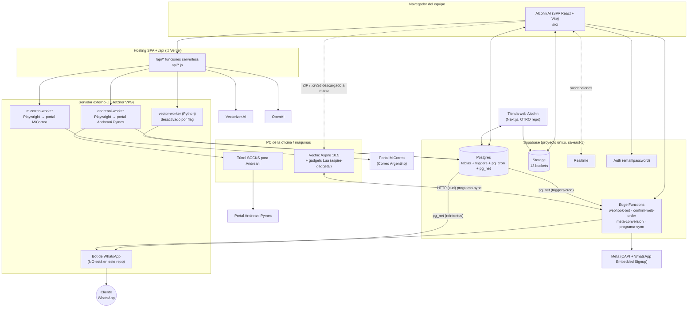

# Mapa del sistema

Cómo se conectan todas las piezas que forman Alcohn AI. ✅ salvo donde se indica.

## 1. Componentes

## 2. Quién escribe en la base de datos

| Actor | Cómo escribe | Qué escribe (resumen) |
|---|---|---|
| **Alcohn AI (navegador)** | supabase-js con la sesión del usuario (JWT `authenticated`) | Casi todo: clientes, órdenes, sellos, programas, direcciones, stock, etc. La lógica de negocio vive mayormente en el cliente. |
| **Triggers de Postgres** | Automáticos al insertar/actualizar | Totales de la orden, restante, costos, historial de estados, `Programado`, prioridad al rehacer, consumo de bronce/stock, webhooks. Ver [08-automations/triggers.md](../08-automations/triggers.md). |
| **pg_cron** | Jobs programados | Deudores automáticos, vencimientos, contactos comerciales, seguimientos de recompra, confirmación/reintento de webhooks. Ver [08-automations/cron.md](../08-automations/cron.md). |
| **Edge Functions** | service role | Estado de envío tras aviso de despacho, sellos de pedidos web, reportes del gadget de Aspire, logs de Meta. |
| **Workers (Hetzner)** | service role (andreani-worker, vector-worker) | Pool de links Andreani, etiquetas Andreani, `Despachado` por tracking; vectores automáticos. |
| **Tienda web** | service role desde API routes de Next.js (🔶 según `modelo-datos-web-supabase.md`) | Clientes web, órdenes web, pagos, mockups web, analítica. |
| **Gadget de Aspire** | HTTP a `programa-sync` con clave de instalación + token por programa | Reporte de sincronización, `.crv3d` subido, sellos no importados/borrados. |

## 3. Canales hacia afuera

| Canal | Dirección | Disparador | Doc |
|---|---|---|---|
| WhatsApp al cliente | Alcohn AI → bot externo → cliente | Triggers (foto subida, despachado), acciones de UI (pedido registrado/actualizado, rehacer, mockups), cron (contacto comercial, recompra) | [07-integrations/whatsapp-bot.md](../07-integrations/whatsapp-bot.md) |
| MiCorreo (Correo Argentino) | Alcohn AI → worker Playwright → portal | Guardar datos de envío | [07-integrations/micorreo.md](../07-integrations/micorreo.md) |
| Andreani Pymes | worker ↔ portal | Botones en Envíos | [07-integrations/andreani.md](../07-integrations/andreani.md) |
| Vectric Aspire | Alcohn AI ↔ gadget Lua (HTTP) y archivos | Operario en la PC de la máquina | [07-integrations/aspire.md](../07-integrations/aspire.md) |
| Vectorizer.AI | Alcohn AI → `/api/vectorize` | Botón "Vectorizar" | [07-integrations/vectorizer-ai.md](../07-integrations/vectorizer-ai.md) |
| OpenAI | Alcohn AI → `/api/*` | Mockups, parseo de datos de envío | [07-integrations/openai.md](../07-integrations/openai.md) |
| Meta Conversions API | DB → edge function | Alta de orden / pago web confirmado | [07-integrations/meta.md](../07-integrations/meta.md) |
| Tienda web | comparte DB | Checkout, mockups web, analítica | [07-integrations/tienda-web.md](../07-integrations/tienda-web.md) |

## 4. Rutas de la aplicación

✅ `src/App.tsx`

| Ruta | Página | Dentro de `OrdersProvider` |
|---|---|---|
| `/` | Inicio | sí |
| `/pedidos` | Pedidos | sí |
| `/envios`, `/envios/:carrier` (`todos`, `correo`, `andreani`, `via-cargo`), `/envios/historial` | Envíos | sí |
| `/economia` | Economía | sí |
| `/produccion` | Producción | no |
| `/programas` | Programas | no |
| `/errores` | Errores (rehaceres) | no |
| `/centro` | Centro Alcohn | no |
| `/vectorizacion` | Vectorización | no |
| `/stock` | Stock | no |
| `/mockups` | Generador de Mockups | no |
| `/comercial` | Comercial Web | no |
| `/precios` | Precios | no |
| `/gastos` | Gastos | no |
| `/innovacion` | Innovación | no |
| `/configuracion` | Configuración (áreas de notificación) | no |
| `/whatsapp` | WhatsApp Bot (conexión Meta) | no |
| `/login` | Login / registro | — (pública) |
| `/stock-pendiente` | Sandbox con datos mock | — (**pública**, fuera de auth) |
| `/admin/registros` | redirige a `/pedidos` | — |
| `/dev/*` | Sandboxes (solo en `npm run dev`) | — |

La barra lateral además muestra **"Verificación"** (`/verificacion`) deshabilitada: 🔶 módulo previsto, sin ruta ni código. → [Q-PROD-006](../14-open-questions/produccion-fabricacion.md#q-prod-006).
