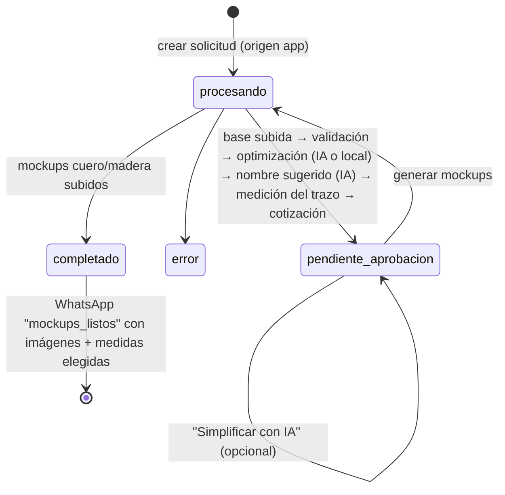

# Generador de Mockups

> Ruta: `/mockups` · Página: `src/app/mockups/index.tsx`, `MockupSlotCard.tsx` · Servicio: `src/lib/supabase/services/mockupSolicitudes.service.ts` · Pipeline: `src/lib/utils/mockupPipeline.ts`, `mockupPythonLikeEffects.ts` · API: `api/optimize-logo.js`, `api/simplify-logo.js`, `api/suggest-mockup-name.js`
> Workflow: [WF-09](../../03-workflows/WF-09-mockup-y-contacto-comercial.md)

## Propósito

✅ Uso confirmado: los vendedores lo usan para hacer **muestras rápidas** en lugar de Photoshop: el cliente manda un logo, la app devuelve la muestra con medidas y precios y se la mandan al cliente cuando se confirma (Q-MOCK-002).

✅ Herramienta de **ventas**: a partir del logo de un potencial cliente, generar imágenes de cómo quedaría el sello marcado en **cuero** y en **madera**, con una **cotización** para varias medidas, y mandárselas por WhatsApp. La misma tabla (`mockup_solicitudes`) la usa el **generador de muestras de la tienda web** (`origen='web'`).

## Pantalla

- Varias **tarjetas** (slots) en paralelo, cada una es una solicitud; debajo, **Historial** con búsqueda.
- Por tarjeta: imagen (archivo o pegar del portapapeles), WhatsApp del cliente, ancho deseado (vacío = alternativas 4 / 6 / 8 cm), opción "omitir análisis" (usar el archivo tal cual), materiales (cuero / madera / ambos).
- Menú con clic derecho: descargar base / optimizado.

## Flujo (✅)

1. INSERT `mockup_solicitudes` (`estado='procesando'`, `origen='app'`, `creado_por`).
2. Sube el original al bucket `foto`.
3. `validateLogoForMockup`: verifica fondo claro y logo oscuro (heurística por píxeles).
4. Optimización: `POST /api/optimize-logo` (OpenAI Images edits, modelo por defecto `gpt-image-2` con fallbacks) o local (`optimizeLogoForMockup`) si falla/omite.
5. Nombre sugerido por IA (`/api/suggest-mockup-name`, `gpt-4o-mini`).
6. Medición del trazo (`logo_trazo_*`: ancho/alto en px, proporción) y **cotización** para medidas alternativas con la tabla de precios → `medidas_cotizacion_json`.
7. `pendiente_aprobacion` ("Listo para revisar"). Opcional: "Simplificar con IA" (`/api/simplify-logo`).
8. Generación de mockups en el navegador sobre texturas (`public/mockup-textures/cuero.jpg.jpeg`, `madera.jpg.jpeg`) con efectos de estampado.
9. `completado` → `notifyMockupsReadyWhatsApp` → edge `webhook-bot` tipo `mockups_listos` con URLs y medidas seleccionadas.

## Relación con pedidos

✅ `sellos.mockup_solicitud_id` y `ordenes.mockup_solicitud_id` vinculan un pedido al mockup de origen. Si la base de un sello viene de un mockup web, la imagen puede estar en buckets privados (`mockups-web`, `logos-web`) y se descarga con URL firmada.

## Datos en vivo

8.876 solicitudes: 2.228 web completadas, **6.271 web en `procesando`**, 344 app completadas, 231 pendientes de aprobación, 5 error. Análisis (2026-09-28) de las ~6.300 web en `procesando`: **~84 % no tiene ningún archivo** (abandonos antes de subir el logo) y **~16 % tiene archivo pero ningún mockup generado** y casi sin contacto (abandono durante la generación o falla); ninguna tiene mockup. Confirmar en el repo de la web si `procesando` se crea al abrir el generador ([Q-MOCK-001](../../14-open-questions/comercial-web.md#q-mock-001)).

## Automatización comercial asociada

✅ Trigger `trg_schedule_contacto_comercial_mockup`: cuando un mockup **web** queda `completado` o `pendiente_aprobacion`, programa un contacto comercial a los **10 minutos** (`metadata_web.contacto_comercial_eligible_at`). El cron cada 2 min lo envía (ver [comercial](../comercial/README.md#automatizaciones)).

## Riesgos

- Endpoints `/api/optimize-logo`, `/api/simplify-logo`, `/api/suggest-mockup-name` sin autenticación (costo OpenAI) → [AUD-SEC-004](../../audits/seguridad.md#aud-sec-004).
