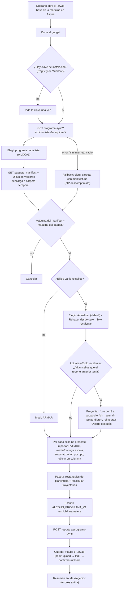

# Gadget de Aspire y sincronización (`programa-sync`)

> Archivos: `aspire-gadgets/ArmarPrograma_Chica.lua` (C), `ArmarPrograma_Grande.lua` (G), `ArmarPrograma_XL.lua` (XL) — v2.1.6 los tres; `aspire-gadgets/TestAlcohnSync.lua` (sonda de pruebas).
> Edge Function: `supabase/functions/programa-sync/index.ts` (desplegada, versión 22, `verify_jwt=false`).
> Contexto de diseño: `PLAN_PROGRAMAS_FASE_3.md` (hallazgos verificados empíricamente sobre Aspire 10.514).

## 1. Qué es

✅ Un **gadget** es un script Lua que corre **dentro de Vectric Aspire** (software CAD/CAM de la máquina), instalado una vez por PC en la carpeta de Gadgets. Hay uno por máquina porque cada máquina tiene columnas de planchuela en posiciones distintas. Automatiza lo que antes era manual: importar cada vector, escalarlo, ubicarlo en la columna de su planchuela, crear capas/offsets, aplicar trayectorias según el tipo, crear los rectángulos de planchuela y recalcular trayectorias.

## 2. Flujo dentro de Aspire (✅ `main()` del gadget)

Puntos clave:
- **Solo `.svg` y `.dxf/.dwg`** se importan. Cualquier otra extensión (típicamente `.eps` de vectores viejos) falla con "el vector está en .eps, re-vectorizalo" y viaja como `sellos_no_importados`.
- **Presencia de un sello** en el job: tag `ALCOHN_SELLO_ID` en su objeto de la capa `Corte` (fuente de verdad) + UUID en nombres de capa (compatibilidad).
- **Modo Actualizar** no toca lo que ya estaba (conserva correcciones manuales). **Rehacer desde cero** borra las capas generadas por el gadget.
- Si Aspire lo ubica en otra columna que la planificada, se reporta como `sellos_en_otra_planchuela`.
- Sellos excluidos a propósito (sin material) se recuerdan en el job para no volver a preguntar.

## 3. API `programa-sync` (✅)

| Método | Acción | Auth | Efecto |
|---|---|---|---|
| GET | `?accion=listar&maquina=C\|G\|XL` | Header `x-programa-sync-key` = secreto `PROGRAMA_SYNC_KEY` | Programas de esa máquina no `FINALIZADO`, con token por programa. |
| GET | `?accion=paquete&programa_id=…` | Clave de instalación | Manifest (JSON + Lua) con sellos ordenados por `created_at`, URLs públicas de vectores, `largo_maximo_mm` (**hardcodeado** en la función: C 400, G 250, XL 250). Rechaza programas finalizados. |
| POST | (reporte JSON) | Token del programa (`programa_sync_token`, 30 días) | Idempotente por `evento_id`. Guarda `sync_payload`, `sync_origen='GADGET'`, `maquinado_minutos` (segundos/60), `material_real_por_planchuela`. Evento `SINCRONIZADO`. Libera `sellos_borrados_en_maquina` (vuelven a su estado previo, `motivo_salida_programa`, evento `SELLO_BORRADO_EN_MAQUINA`). Marca `no_importado_motivo`, evento `SELLO_NO_IMPORTADO` y notificación **p7** por cada sello que no entró. Limpia `no_importado_motivo` de los importados ahora. **No toca** candado, verificado ni `estado_programa`. |
| POST | `?accion=pedir-upload` | Token | URL firmada para subir el `.crv3d` a `programas-aspire`. |
| POST | `?accion=confirmar-upload` | Token | Vincula el archivo al programa, genera preview GIF si ≤18 MB y no es ZIP, `dirty=false`, **`BORRADOR → LISTO`**, borra el Aspire anterior. Evento `ASPIRE_SUBIDO` (origen GADGET). |
| POST | `?accion=subir-archivo` | Token (headers) | Alternativa: sube el binario por el body (≤45 MB) y confirma. |

## 4. El paquete ZIP (camino alternativo / sin internet)

✅ `generateAndDownloadProgramPackage` arma: `vectores/NNN_<sello_id>.<ext>`, `manifest.lua` (con token), `<nombre>.crv3d` + alias `programa.crv3d` (el base de la máquina), `LEEME.txt` si no hay base, `ERRORES.txt` si algún vector no se pudo bajar. Lo sube a `programas-zip`, marca `LISTO` y lo descarga en el navegador. El gadget **no** va dentro del ZIP (se instala una vez por PC).

## 5. Archivos base por máquina

✅ `programa_archivos_base` (una fila por C/G/XL): `archivo_base_url` (`.crv3d`) y `archivo_gadget_url` (`.lua`) en el bucket `programas-base`. Se reemplazan desde la UI de Programas. Hoy las tres máquinas tienen ambos cargados.
🔶 Según PLAN F3 §1.7, el base de la máquina C arrastraba sellos y capas viejas; la limpieza era manual. ❓ [Q-PROG-006](../../14-open-questions/programas.md#q-prog-006).

## 6. Lo que NO hace (todavía)

- ✅ **No sube las trayectorias** (`.txt` del postprocesador): la tabla `programa_trayectorias` y el bucket existen, pero la edge function no tiene el endpoint (plan F3 §5.8). El operario guarda las trayectorias a mano en Aspire.
- ✅ No decide agrupado de trayectorias.
- ❓ Cómo llegan las trayectorias a la máquina CNC, quién la opera, cómo se fija el material → [FR-04](../../10-operational-boundaries/README.md#fr-04), [Q-CNC-002…](../../14-open-questions/produccion-fabricacion.md).

## 7. Seguridad (observaciones)

- La clave de instalación (`PROGRAMA_SYNC_KEY`) es única para todas las PCs y máquinas; se guarda en el Registry de cada PC.
- `listar` devuelve el **token de cada programa** a quien tenga la clave de instalación; con ese token se puede reportar/subir archivos a ese programa.
- Los buckets `programas-aspire` y `programas-preview` aceptan INSERT/UPDATE del rol `anon` (políticas `programas_aspire_anon_insert`, `programas_preview_anon_insert`). Ver [audits/seguridad.md](../../audits/seguridad.md).
