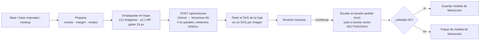

# Vectorización

> Ruta: `/vectorizacion` · Página: `src/app/vectorizacion/index.tsx` · Lógica: `src/lib/vectorizacion/*` · Store: `src/lib/state/vectorizacion.store.ts` · API: `api/vectorize.js`, `api/vectorizer-account.js`
> Workflow: [WF-03](../../03-workflows/WF-03-diseno-y-vectorizacion.md) · Medida: [medida-de-fabricacion.md](medida-de-fabricacion.md) · Integración: [07-integrations/vectorizer-ai.md](../../07-integrations/vectorizer-ai.md)
> Página nueva (changelog #4, 2026-09-15): "generar el SVG ahí mismo, sin el programa de escritorio".

## Propósito

✅ Convertir el **archivo base** que mandó el cliente (imagen: logo, dibujo) en un **vector SVG** listo para Aspire, con el tamaño físico pedido, y guardarlo en el ítem. Es el paso que habilita que un sello entre a un **programa**.

✅ Hoy se vectoriza desde esta página (el programa de escritorio anterior ya no se usa). Los casos difíciles se hacen a mano en **Illustrator**. El retoque previo de la imagen se hace con IA (en general ChatGPT). Responsable: Fede. La vectorización automática con Python quedó descartada por ahora: Vectorizer.AI funciona mucho mejor (Q-VEC-001…003).

## Pestañas

### Pedidos (pendientes)
- ✅ Lista ítems `SELLO` con archivo base, **sin vector**, estado de vectorización ≠ `VECTORIZADO`, en `Sin Hacer` (o también `Rehacer`/`Prioridad` si se activa el toggle). Orden: prioritarios primero, después por fecha límite.
- Al seleccionar, se **prepara** la imagen: se baja el base (o la **base mejorada**, o la imagen del mockup si viene de la web), se recorta (editor de recorte), se agrega margen y se limpia (niveles). Vista de la "hoja" que se va a mandar.
- **Vectorizar**: diálogo de confirmación con el costo en créditos (1 por hoja) y el saldo. Modos: `production` (cobra), `test` (gratis, con marca de agua), `preview`.
- Resultado → cola de **Revisión**.

### Lote libre
- ✅ Soltar imágenes sueltas (no ligadas a pedidos), vectorizar y **descargar un ZIP** con los SVG. No escribe en la base.

### Asignar SVG
- ✅ Subir SVGs ya hechos (por otra vía) y emparejarlos automáticamente con pendientes por **nombre de archivo** (`matchByName`: normaliza, ignora palabras como "logo", "vector", "final", puntúa por bigramas). Confirmar → guarda cada SVG en su ítem (mismo `saveSelloVector`).

### Revisión
- ✅ Cola **persistida en este navegador** (IndexedDB): si cerrás o recargás la pestaña, los SVG de revisión se recuperan al volver a Vectorización. No se sincroniza entre PCs. Por cada resultado: antes/después, **Confirmar** (guarda), **Rechazar**, **Reemplazar con un SVG propio**, descargar todo.

## Pipeline (✅)

- Agrupar varias imágenes en una hoja **ahorra créditos**: la UI calcula 1 crédito por **hoja** (una llamada a Vectorizer.AI), no por imagen.
- Preset `ALCOHN_PRESET`: 2 colores (negro/blanco), fondo blanco a transparente, formas por recorte (`cutouts`), SVG 1.1. El servidor (`api/_vectorizerPreset.js`) es la autoridad; solo 3 parámetros se pueden sobreescribir.
- Solo el modo `production` puede guardarse en un ítem.

## Base mejorada

✅ Menú contextual sobre la imagen (`CardImageContextMenu`): **copiar imagen**, **guardar imagen**, **reemplazar desde el portapapeles** (sube la imagen del portapapeles como `archivo_base_mejorado` sin tocar el original) y **restaurar original**.
🔶 Flujo implícito: copiar la imagen, retocarla en un editor externo y pegarla de vuelta. ❓ Qué herramienta y criterio → [Q-VEC-002](../../14-open-questions/vectorizacion.md#q-vec-002).

## Estados que escribe

`sellos.estado_vectorizacion`: `VECTORIZADO` al confirmar; `archivo_vector_preview` = URL del SVG; `error_vectorizacion_mensaje` limpio; `ancho_fabricacion_mm`/`largo_fabricacion_mm` si no hace falta revisión. `archivo_base_mejorado(_at)`. Cada cambio de `estado_vectorizacion` queda en `estado_historial` (BR-FAB-006). Ver [06-state-machines/vectorizacion.md](../../06-state-machines/vectorizacion.md).

## Vectorización automática (desactivada)

✅ Existe un camino alternativo: al subir un base, encolar un job en el **vector-worker** (Python, `vector_jobs`), que vectoriza sin intervención. Está apagado salvo que `VITE_VECTOR_AUTO_ENABLED=true` ("Desactivada hasta que el pipeline esté listo", `src/lib/config/vectorAuto.ts`). Hay 70 jobs históricos (61 OK, 9 error). Ver [07-integrations/vector-worker.md](../../07-integrations/vector-worker.md).

## Onboarding

Tour en la primera visita (`VectorizarOnboardingHost`, `lib/vectorizacion/onboarding.ts`).

## Riesgos / observaciones

- `/api/vectorize` no exige autenticación: cualquiera con la URL puede consumir créditos ([AUD-SEC-004](../../audits/seguridad.md#aud-sec-004)).
- La cola de revisión persiste en IndexedDB del mismo navegador hasta confirmar/rechazar; no entre dispositivos ([Q-VEC-006](../../14-open-questions/vectorizacion.md#q-vec-006)).
- ✅ Dentro del mismo navegador: un ítem por sello (`dedupeReviewItems` / `mergeReviewItems`); sincronización entre pestañas vía `BroadcastChannel`; no se puede vectorizar de nuevo un sello ya en Revisión o ya `VECTORIZADO`.

## Implementación relacionada

`src/components/vectorizacion/**`, `src/lib/vectorizacion/{vectorizacion.service,runVectorizacion,usePendientesRun,sheetPacking,sheetCompose,svgSplit,saveVector,svgSize,matchByName,imagePrep,prepareImage,imageSource,replaceBaseClipboard,zipResults,vectorizerApi,vectorizerPreset}.ts`, `api/vectorize.js`, `api/_vectorizerClient.js`, `api/_vectorizerPreset.js`, `vite-vectorizer-proxy.ts` (proxy local en desarrollo). Investigación de alternativas: `deep-research-report.md`.
