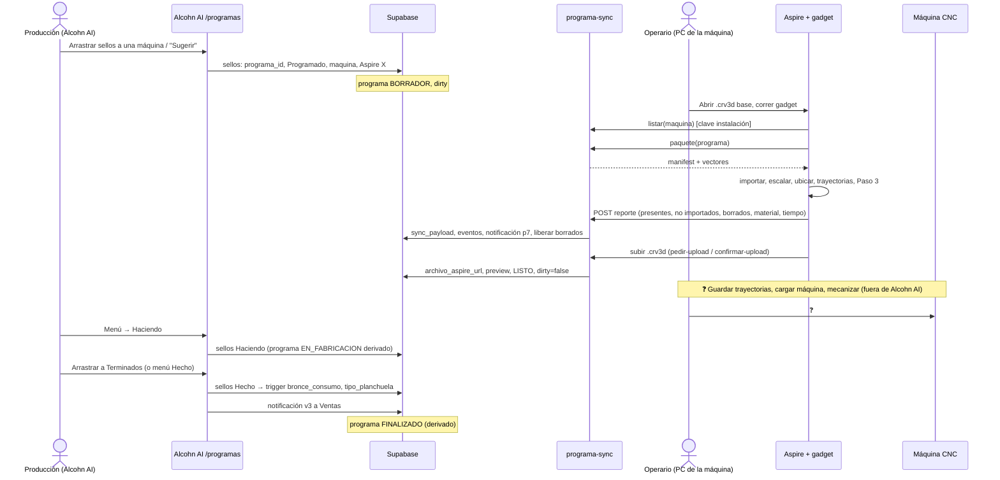

# WF-04 · Programa y fabricación CNC

| | |
|---|---|
| **Inicio** | Hay sellos vectorizados elegibles (panel "Vectores" en Programas; badge del menú si hay urgentes). |
| **Actores** | Fede: arma el programa en Alcohn AI, opera Aspire y las dos CNC. |
| **Módulos** | Programas, gadget de Aspire / `programa-sync`, Producción, Notificaciones, Stock (bronce) |
| **Resultado** | Sellos en `Hecho`, programa `FINALIZADO`, consumo de bronce registrado, Ventas notificada. |

## Diagrama

## Pasos

1. **Armar** (Programas):
   - Arrastrar un sello a un bolsillo vacío (crea programa con nombre automático y fecha de hoy) o a un programa existente; o abrir la hoja → **+** → filtrar por planchuela → **Sugerir** (prioridad + antigüedad, hasta llenar planchuelas).
   - Validaciones: máquina admite la planchuela del sello; no superar el largo máximo por planchuela.
   - Criterio confirmado: prioritarios → más viejos → aprovechar la planchuela; un programa por día por máquina.
2. **Llevar a Aspire**:
   - Preferido: en la PC de la máquina, abrir el `.crv3d` base y correr el gadget → elige el programa de la lista (baja el paquete solo).
   - Alternativa sin internet: **Descargar** el ZIP en Alcohn AI, descomprimir, correr el gadget eligiendo la carpeta.
3. **Gadget** (ver [gadget-aspire.md](../02-modules/programas/gadget-aspire.md)): modo Armar/Actualizar/Rehacer/Solo recalcular; importa SVG/DXF; rechaza EPS; pregunta por sellos faltantes; recalcula; reporta; sube el `.crv3d`.
4. **Resultado en Alcohn AI**: hoja en **Listo para Fabricar**, preview 2D, alertas (no importados, otra planchuela, sobrantes). Sellos que el operario borró por falta de material vuelven a la cola (`motivo_salida_programa='SIN_MATERIAL'`).
5. **Fabricar** (externo, confirmado): guardar trayectorias en pendrive, cargarlas en la CNC, colocar planchuelas precortadas, dejar corriendo (→ Haciendo), cortar y probar en cuero (→ Hecho). El armado con mango/varilla lo hace Cachi al despachar → [FR-04](../10-operational-boundaries/README.md#fr-04), [SOP fabricar un sello](../11-operations-sops/fabricar-un-sello.md).
6. **Registrar avance**: menú del programa → **Haciendo**; al terminar arrastrar a **Terminados** (todos `Hecho`) o, desde la vista lista, revisar sello por sello (Hecho/Retocar/Rehacer). También se puede marcar por sello en Producción/Pedidos.
7. **Efectos de `Hecho`** (✅): trigger `registrar_bronce_consumo_sello` (cada vez que un ítem `SELLO` entra a `Hecho`; si se rehace y vuelve a `Hecho`, registra otro consumo) guarda largo y costo de bronce y fija `tipo_planchuela`; notificación v3 "N sellos terminados" a Ventas; el programa pasa a `FINALIZADO` cuando todos sus sellos están `Hecho`/`Verificar`.

## Cambios de estado

| Momento | Sello | Programa |
|---|---|---|
| Agregar | `Programado`, `Aspire X`, máquina | `BORRADOR`, `dirty` |
| Paquete/gadget OK | — | `LISTO` |
| Haciendo | `Haciendo` | `EN_FABRICACION` (derivado) |
| Terminado | `Hecho` | `FINALIZADO` (derivado) |
| Falla | `Rehacer` (+prioridad) | vuelve a no finalizado |
| Sacado por material | estado previo, `SIN_MATERIAL` | cantidad recalculada |

## Excepciones

- Vector `.eps` → no entra al Aspire; hay que re-vectorizar el sello (Camino A de WF-03) y correr **Actualizar**.
- Prioritario de último momento: se agrega al programa aunque ya se haya descargado (no hay bloqueo automático) y se corre **Actualizar**.
- Programa con candado: no se puede editar; los cambios de estado sí.
- Marcar `Rehacer` desde el menú del programa **no** pide motivo (a diferencia de Pedidos/Producción). El equipo quiere que lo pida (POL-016, pendiente).

## Preguntas

[Q-PROG-*](../14-open-questions/programas.md), [Q-CNC-*](../14-open-questions/produccion-fabricacion.md).
