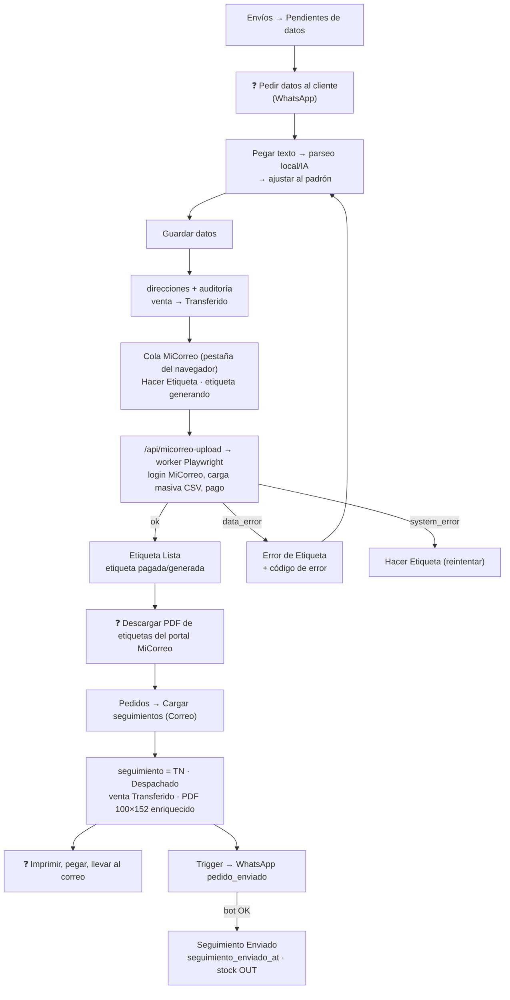

# WF-06 · Envío por Correo Argentino

| | |
|---|---|
| **Inicio** | Orden con todos los ítems `Hecho`, sin Deudor, empresa Correo Argentino **o sin empresa**, venta `Foto`/`Transferido`. |
| **Actores** | 🔶 Logística; cliente (da sus datos); micorreo-worker; bot. |
| **Módulos** | Envíos, Pedidos (Cargar seguimientos), MiCorreo, WhatsApp, Stock, Historial |
| **Resultado** | Orden `Seguimiento Enviado`, cliente con número de seguimiento, stock descontado. |

## Diagrama

## Pasos

1. La orden aparece en **Envíos → Correo → Pendientes de datos** (sin dirección).
2. ❓ Pedir al cliente nombre, dirección o sucursal, CP, teléfono, email → [FR-09](../10-operational-boundaries/README.md#fr-09).
3. Abrir el diálogo, **pegar el texto**, "Interpretar" (reglas locales) o "Usar IA"; ajustar provincia/localidad/sucursal a las opciones del padrón; elegir Domicilio/Sucursal (o código de sucursal manual).
4. "Continuar" (valida la fila CSV) → "Guardar".
5. ✅ Efectos: nueva `direcciones`, auditoría de quién cargó, email al cliente si faltaba, **venta → Transferido**, notificación l1 si ya había etiqueta, y **subida a MiCorreo en segundo plano** (una por vez, con pausa). ⚠️ La cola vive en la pestaña: si se cierra antes de procesar, la subida no ocurre (queda el flag `micorreo_subiendo_at` en la orden).
6. ✅ Worker: arma el CSV (medidas/peso según contenido), inicia sesión en MiCorreo, hace la carga masiva y **paga la etiqueta** con la cuenta de Alcohn (`payAfterUpload=true`). Resultado → `Etiqueta Lista` + `etiqueta_estado` `pagada` (o `generada` si el pago quedó pendiente) | `Error de Etiqueta` con código (`cp_localidad_invalido`, `sucursal_invalida`, `provincia_invalida`, `telefono_invalido`, `email_invalido`, `pago_rechazado`, `validacion_csv`) | `Hacer Etiqueta` (error de sistema).
7. Si hay error: corregir datos y volver a guardar (reintenta). Respaldo: **Generar CSV** manual y ❓ subirlo a mano al portal.
8. ❓ Descargar el PDF de etiquetas desde MiCorreo → [Q-COR-003](../14-open-questions/envios.md#q-cor-003).
9. Pedidos → **Cargar seguimientos** → origen Correo → subir PDF → revisar emparejamientos → Aplicar: `seguimiento`, **`Despachado`**, venta Transferido; se descarga el PDF enriquecido 100×152.
10. ❓ Imprimir, pegar etiquetas, embalar, llevar al correo → [FR-07](../10-operational-boundaries/README.md#fr-07).
11. ✅ Trigger `trigger_envio_despachado` → WhatsApp `pedido_enviado` (link de seguimiento de Correo). Cuando el bot responde OK (edge function o cron `confirmar_webhooks_pendientes` cada 2 min) → **`Seguimiento Enviado`**, `seguimiento_enviado_at`, y trigger de **consumo de stock**.

## Estados

`estado_envio`: (`NULL`/`Sin envio`) → `Hacer Etiqueta` → `Etiqueta Lista` | `Error de Etiqueta` → `Despachado` → `Seguimiento Enviado`. `etiqueta_estado`: `generando` → `generada`/`pagada`/`error`. Ver [06-state-machines/envio.md](../06-state-machines/envio.md).

## Excepciones

- "Despachado" se marca al cargar el PDF, que Cachi hace **justo antes de ir al correo** (confirmado).
- Si el WhatsApp falla 3 veces (reintentos durante 1 h), la orden queda en `Despachado`.
- Cambiar la dirección después de la etiqueta no anula la etiqueta en MiCorreo (solo notifica l1); se cancela a mano en MiCorreo y reintegran el dinero (Q-COR-004).
- Orden sin empresa cae en este flujo.

## Preguntas

[Q-ENV-*, Q-COR-*](../14-open-questions/envios.md).
