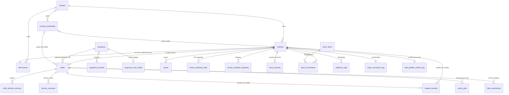

# Modelo de datos

> Fuente de verdad: la base de datos en vivo (Supabase, esquema `public`, 57 tablas/vistas al 2026-09-27). `src/lib/supabase/types.ts` (tipos generados) y `database_schema.sql`/`database_documentation.md` (raíz) están **parcialmente desactualizados**. Para volver a verificar ver [12-architecture/base-de-datos.md](../12-architecture/base-de-datos.md).

## 1. Núcleo del negocio

## 2. Fichas de entidad

| Entidad | Tabla(s) | Ficha |
|---|---|---|
| Cliente | `clientes` | [cliente.md](entidades/cliente.md) |
| Orden / pedido | `ordenes` | [orden.md](entidades/orden.md) |
| Ítem / sello | `sellos` | [sello.md](entidades/sello.md) |
| Dirección de envío | `direcciones` | [direccion.md](entidades/direccion.md) |
| Programa | `programa`, `programa_eventos`, `programa_sync_token`, `programa_archivos_base`, `programa_trayectorias` | [programa.md](entidades/programa.md) |
| Mockup / solicitud | `mockup_solicitudes` | [mockup-solicitud.md](entidades/mockup-solicitud.md) |
| Andreani | `envios_andreani_links`, `envios_andreani_etiquetas` | [andreani.md](entidades/andreani.md) |
| Stock y bronce | `stock_items`, `stock_movements`, `stock_alert_assignments`, `bronce_consumo` | [stock-y-bronce.md](entidades/stock-y-bronce.md) |
| Catálogos y parámetros | `correo_sucursales`, `costos_de_envio`, `fabricacion_parametros`, `precios_*`, `catalogo_items` | [catalogos-y-parametros.md](entidades/catalogos-y-parametros.md) |
| Tareas | `tareas`, `tareas_dashboard`, `tareas_pedidos_globales` | [tareas.md](entidades/tareas.md) |
| Notificaciones | `notificaciones`, `notificacion_destinatarios`, `usuario_area` | [../02-modules/notificaciones](../02-modules/notificaciones/README.md) |
| Registros y auditoría | `estado_historial`, `envio_eventos`, `sello_rehacer_eventos`, `webhook_logs`, `meta_conversion_log`, `web_pedido_confirm_log`, `web_analytics_events`, `vector_jobs`, `fotos_pendientes` | [registros.md](entidades/registros.md) |
| Usuarios y preferencias | `auth.users`, `solicitudes_registro`, `usuario_area`, `changelog_visto`, `vistas_tabla` | [usuarios.md](entidades/usuarios.md) |
| Economía | `economia_settings`, `economia_movimientos_reales`, `economia_gastos_mensuales` | [../02-modules/economia-gastos](../02-modules/economia-gastos/README.md) |
| Innovación | `innovation_*` (8 tablas) | [../02-modules/innovacion](../02-modules/innovacion/README.md) |

## 3. Vistas

| Vista | Uso |
|---|---|
| `v_web_mockups_sin_compra` | Potenciales (mockups web completados sin orden) |
| `v_web_ordenes_seguimiento_pago` | Órdenes web con pago pendiente |
| `v_comercial_clientes_seguimiento_elegibles` | Elegibles para recompra |
| `v_comercial_cliente_seguimiento_resumen` / `_historial` | Métricas y registro de recompra |

## 4. Storage

Ver [storage.md](storage.md).

## 5. Nombres inconsistentes

Ver [inconsistencias-de-nombres.md](inconsistencias-de-nombres.md) — **leer antes de escribir queries**: "sello" no siempre es un sello, `ancho` es el lado mayor, los estados de la orden mezclan venta y envío, etc.
