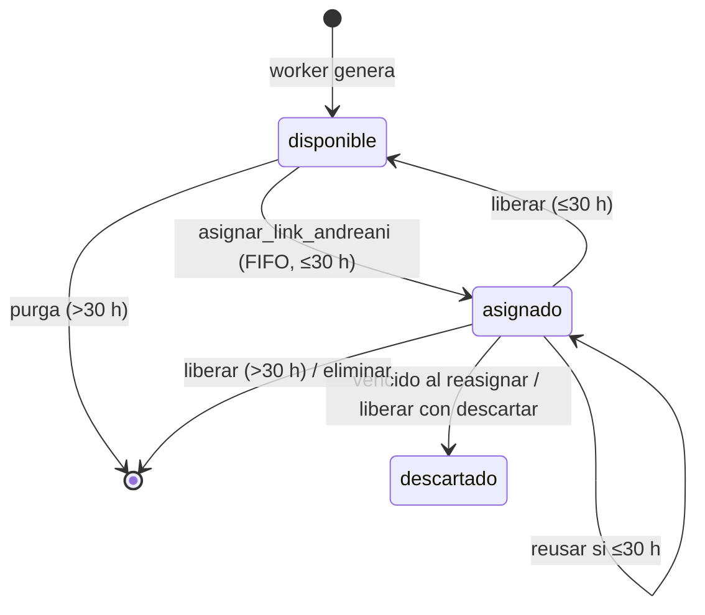
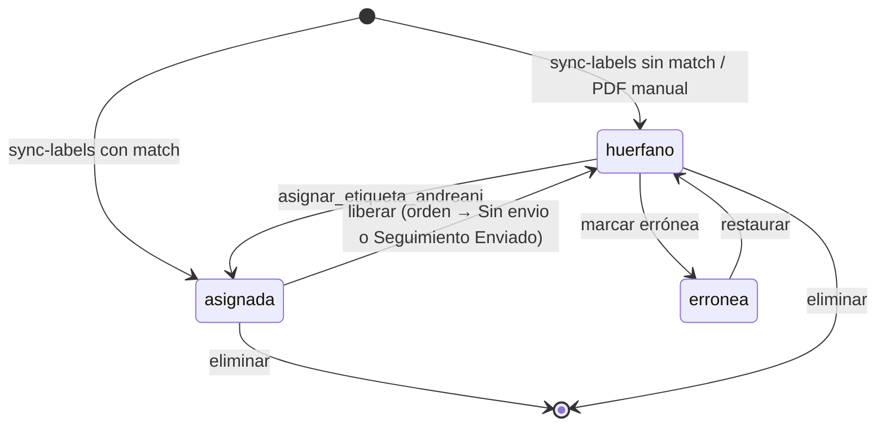

# Máquinas de estado — Andreani

## Link (`envios_andreani_links.estado`)

## Etiqueta (`envios_andreani_etiquetas.estado`)

Control: **DB** (funciones con validaciones y `FOR UPDATE`). Ver [BR-AND-*](../04-business-rules/envios.md).
