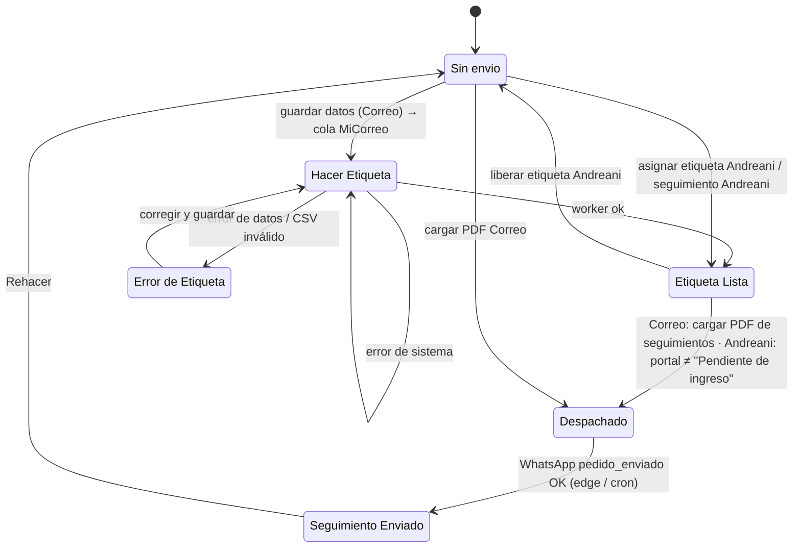

# Máquina de estados — Envío (`ordenes.estado_envio`)

Valores (CHECK): `Sin envio`, `Hacer Etiqueta`, `Error de Etiqueta`, `Etiqueta Lista`, `Despachado`, `Seguimiento Enviado` (nulo = sin envío).

| Estado | Significa | Entrada | Efectos |
|---|---|---|---|
| `Sin envio` | No se inició el envío | Alta (nulo), Rehacer, reset masivo, liberar etiqueta | — |
| `Hacer Etiqueta` | Falta generar etiqueta / en proceso | Subida MiCorreo iniciada o error de sistema | Incluida en el CSV manual |
| `Error de Etiqueta` | MiCorreo rechazó los datos | Worker `data_error`, CSV inválido | Mensaje en `error_etiqueta_mensaje` |
| `Etiqueta Lista` | Etiqueta generada (y en Correo, pagada) | Worker ok; etiqueta Andreani asignada | Candidata a Despachado |
| `Despachado` | El pedido se envió (ver nota) | Correo: PDF de seguimientos; Andreani: tracking en tránsito | ✅ Trigger WhatsApp `pedido_enviado` si hay seguimiento |
| `Seguimiento Enviado` | Cliente recibió su seguimiento | Bot OK (solo desde `Despachado`) | ✅ `seguimiento_enviado_at`, consumo de stock, sale de Envíos, recompra, historial |

✅ **"Despachado" = el pedido se envió** (confirmado, Q-ENV-001). La diferencia de momento es operativa: en **Correo** Cachi sube el PDF de seguimientos **justo antes de ir al correo** (así arranca la automatización); en **Andreani** las etiquetas se traen de su página y el estado llega **después** de despachar, cuando el portal registra el ingreso. No es un error a corregir.

## Estado de la etiqueta MiCorreo (`ordenes.etiqueta_estado`)

`pendiente` (sin uso visto) → `generando` → `generada` (subida ok, pago pendiente) | `pagada` | `error`. `pagando` existe en el CHECK sin uso. En vivo: pagada 331, generada 60, error 10, **generando 10** (🔶 posibles subidas interrumpidas por cerrar la pestaña).

## Control

- **DB**: `Despachado → Seguimiento Enviado` (solo si sigue en Despachado), `seguimiento_enviado_at`, consumo de stock.
- **UI**: el selector de envío solo si la venta está Transferido.
- Transiciones posibles pero no producidas por el sistema: cualquier salto manual desde Pedidos/Envíos.
