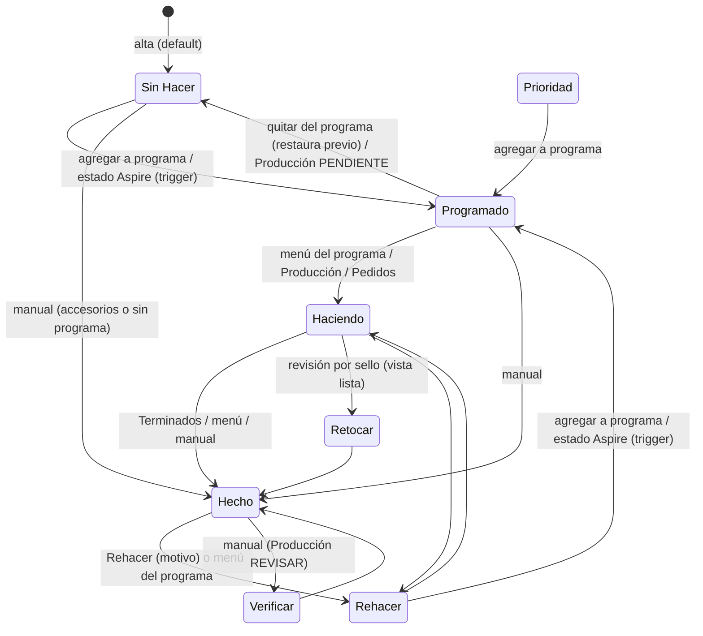

# Máquina de estados — Fabricación (`sellos.estado_fabricacion`)

Valores permitidos (CHECK): `Sin Hacer`, `Haciendo`, `Hecho`, `Rehacer`, `Retocar`, `Prioridad` (legado), `Verificar`, `Programado`.

## Semántica

| Estado | Significa (🔶 salvo ✅) | Cómo se entra | Qué habilita | Qué bloquea / efectos |
|---|---|---|---|---|
| `Sin Hacer` | Pendiente de fabricar | ✅ Alta; quitar de programa; Producción "PENDIENTE" | Elegible para programa (si es SELLO vectorizado); aparece en Vectorización | — |
| `Programado` | Está en un programa CNC (o tiene estado Aspire) | ✅ `addStampsToProgram`; trigger `detect_programado_state` | Aparece en la hoja del programa | Deja de ser elegible para otros programas |
| `Haciendo` | La máquina quedó corriendo (lo marca Fede al dejarla andando) | ✅ Manual | Programa → "En fabricación" | — |
| `Retocar` | Salió un detalle mal que se corrige sin rehacer | ✅ Solo desde `DoneReviewDialog` (vista lista de Programas) | Programa → "En fabricación" | En Producción se ve como EN_PROGRESO/REVISAR |
| `Verificar` | Producción no está segura de que salió bien; lo chequea Ventas | ✅ Producción "REVISAR" | Cuenta como terminado para el programa | 1 fila en la base |
| `Hecho` | Cortado, sacado de la máquina y **probado en cuero** | ✅ Manual (programa, Producción, Pedidos) | Venta editable; cola "Enviar foto"; Envíos (si todos los ítems) | ✅ Trigger: consumo de bronce y `tipo_planchuela` (en cada entrada a Hecho); notificación v3 |
| `Rehacer` | Hay que volver a fabricarlo | ✅ Diálogo Rehacer (RPC) o menú del programa | Elegible para programa; aparece en Vectorización con el toggle | ✅ Prioridad automática; (vía RPC) reset de foto/venta/envío |
| `Prioridad` | Legado: antes indicaba prioridad | Solo datos viejos (4) | Elegible para programa | Se muestra como `Sin Hacer` |

## Quién controla las transiciones

- **DB**: solo `detect_programado_state` (fuerza `Programado`) y `sellos_rehacer_auto_prioridad` (prioridad). Todo lo demás es **UI/servicio**.
- **Inválidas pero posibles**: `Hecho → Sin Hacer`, `Programado → Hecho` sin pasar por Haciendo, `Hecho` sin foto ni vector, cambiar a `Programado` a mano sin programa (Producción permite elegir estado Aspire).

## Prioridad (`es_prioritario`)

Flag independiente del estado. Se prende a mano o al entrar a `Rehacer`. Ordena primero en Vectorización, Programas (panel y "Sugerir") y en el badge de urgentes. Notificación p3.

## Estado Aspire (`sellos.estado_aspire`)
Valores: `Aspire C|G|XL` y `Aspire C|G|XL Check`.
- ✅ Programas lo pone al agregar (`Aspire <máquina>`) y lo cambia a `Check` al verificar el programa; lo borra al quitar el sello.
- ✅ Producción permite elegirlo a mano (→ `Programado`) y lo borra al cambiar el estado de fabricación.
- ✅ Rehacer lo borra.
- ✅ Hoy lo maneja solo el módulo Programas (Q-PROD-003); la edición manual en Producción es legado.
