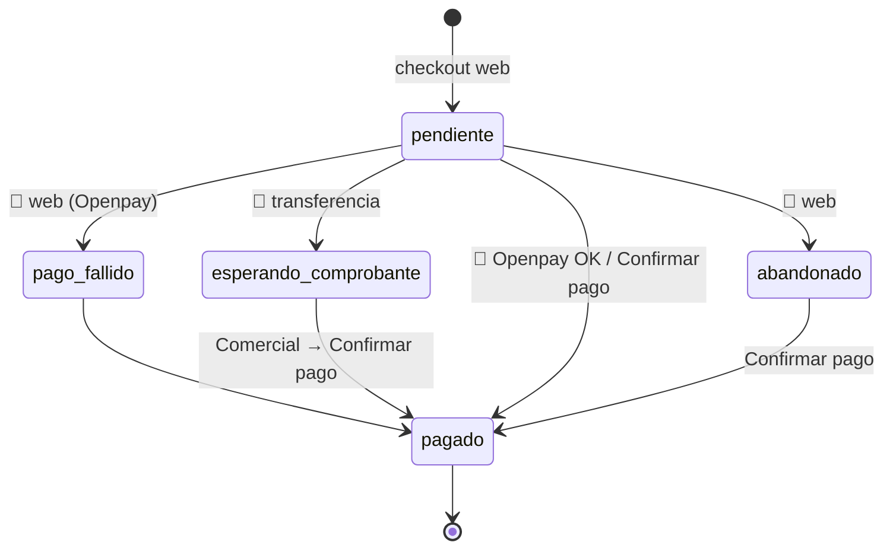

# Máquina de estados — Pago web (`ordenes.estado_pago_web`)

Solo para `origen='Web'`. Valores: `pendiente`, `pago_fallido`, `esperando_comprobante`, `pagado`, `abandonado`. En vivo: pagado 91, esperando_comprobante 49, pendiente 36.

- ✅ `pagado` es terminal (trigger `trg_preserve_web_pago_confirmado`).
- ✅ Al llegar a `pagado`: visible en la app, `confirm-web-order`, Meta Purchase.
- 🔶 Las transiciones a `pago_fallido`/`esperando_comprobante`/`abandonado` las hace la tienda web (no están en este repo). ❓ [Q-WEB-002](../14-open-questions/comercial-web.md#q-web-002).
