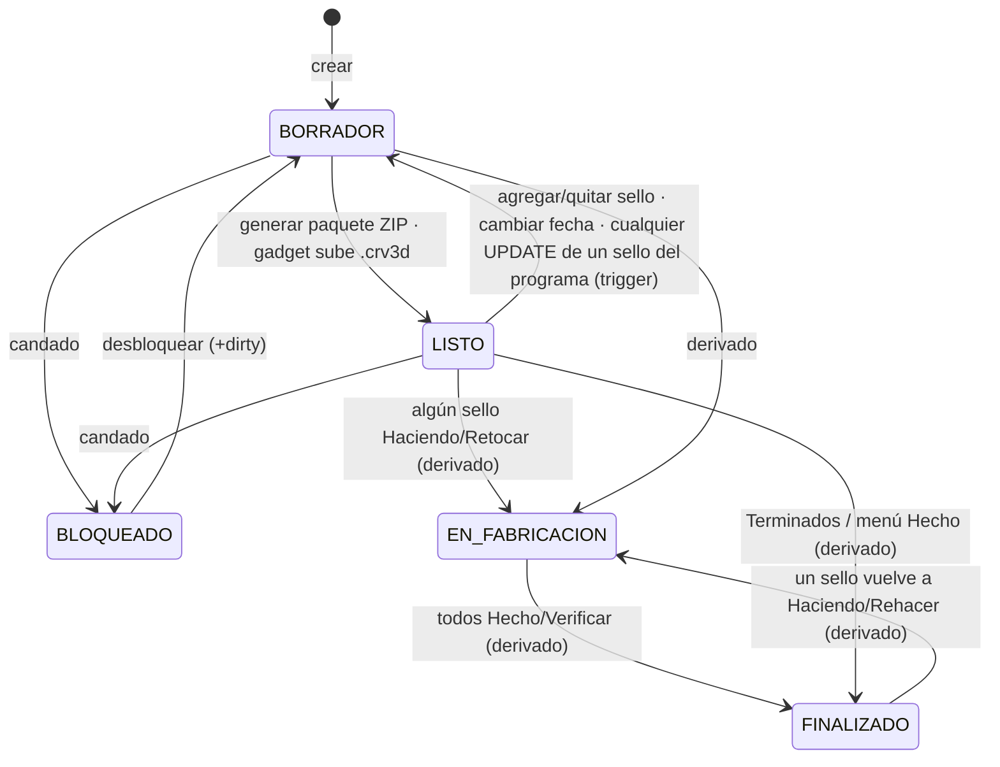

# Máquina de estados — Programa (`programa.estado_programa`)

Valores (CHECK): `BORRADOR`, `LISTO`, `BLOQUEADO`, `EN_FABRICACION`, `FINALIZADO`. Flags: `bloqueado`, `dirty`, `verificado`.

| Estado | Etiqueta UI | Significa | Entrada |
|---|---|---|---|
| `BORRADOR` | Borrador | Armándose o cambió desde el último paquete | Crear, editar, desbloquear |
| `LISTO` | **Listo para Fabricar** | Paquete generado o `.crv3d` subido por el gadget | `markProgramPackageReady`, edge `confirmar-upload` |
| `BLOQUEADO` | candado | Congelado manualmente | `lockProgram` |
| `EN_FABRICACION` | En fabricación | Hay sellos en `Haciendo`/`Retocar` | Derivado |
| `FINALIZADO` | Finalizado | Todos los sellos `Hecho`/`Verificar` | Derivado; va a "Terminados" |

## Cómo se calcula

`deriveLifecycleFromStamps(base, bloqueado, stamps)` en el navegador: candado > sin sellos > todos terminados > alguno en curso > estado guardado. `getPrograms()` **persiste** `EN_FABRICACION`/`FINALIZADO` si difieren (escritura como efecto de leer).

## `dirty`

"Desactualizado desde la última descarga": `true` al crear, editar o desbloquear; `false` al generar el paquete o recibir el `.crv3d` del gadget. La alerta se muestra solo si además hay ZIP generado.

## Interacciones peligrosas

- El trigger `mark_programa_dirty_on_sello_relevant_update` marca `dirty` y devuelve `LISTO → BORRADOR` ante **cualquier** UPDATE de un sello que sigue en el programa, incluido pasarlo a `Haciendo`/`Hecho`. En la práctica el estado derivado lo tapa, pero `estado_programa` guardado y `dirty` quedan en valores que no reflejan "cambió el contenido". → [AUD-INC-008](../audits/inconsistencias.md#aud-inc-008).
- Un sello sacado a `Sin Hacer` desde Producción sigue con `programa_id` y el programa no se entera por la vía normal.
