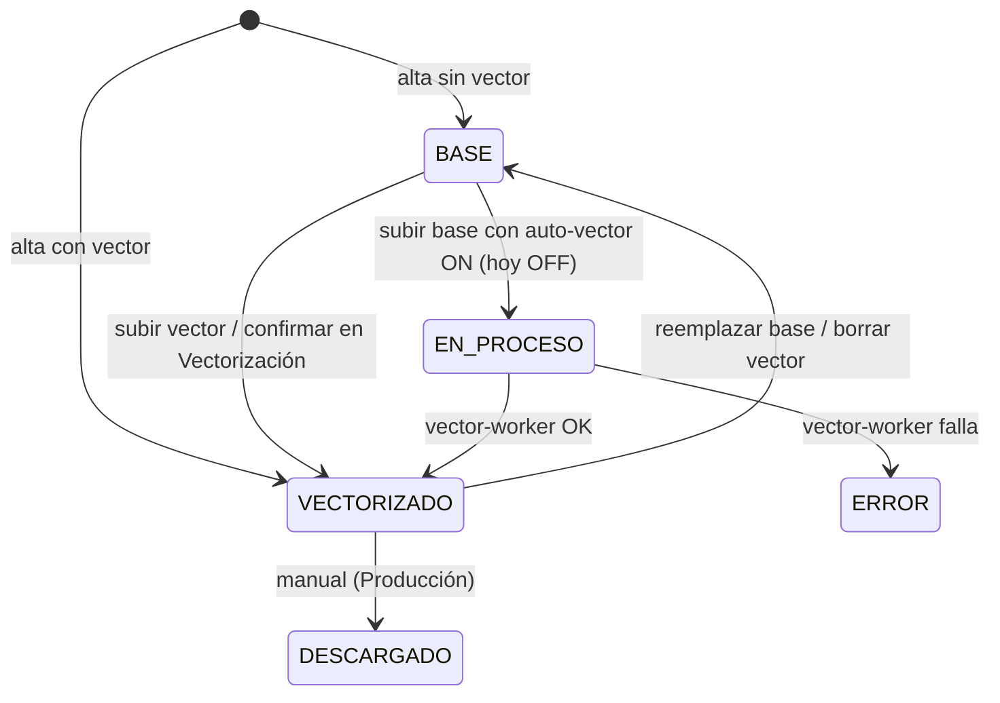

# Máquina de estados — Vectorización (`sellos.estado_vectorizacion`)

Valores (CHECK): `BASE`, `EN_PROCESO`, `VECTORIZADO`, `DESCARGADO`, `ERROR` (nulo en 82 ítems viejos).

| Estado | Significa | Notas |
|---|---|---|
| `BASE` | Solo hay archivo base (o nada) | Aparece en Vectorización si tiene base |
| `EN_PROCESO` | Encolado en el vector-worker | 1 en la base |
| `VECTORIZADO` | Tiene vector en `archivo_vector_preview` | Requisito para Programas |
| `DESCARGADO` | 🔶 Legado: el vector ya se descargó para programar a mano | Se puede elegir en Producción; 15 filas |
| `ERROR` | Falló la vectorización automática | `error_vectorizacion_mensaje` |

Control: ninguno en la DB más allá del CHECK. ⚠️ "VECTORIZADO" no garantiza **SVG**: puede ser EPS/PDF/AI, que el gadget no importa.

## Cola de Revisión (navegador)

✅ La pestaña Revisión vive en el store + IndexedDB del navegador (no en `estado_vectorizacion`). Dedupe por `selloId` (gana el más nuevo); hidratación limpia duplicados; pestañas del mismo origen se sincronizan con `BroadcastChannel`. Barreras antes de gastar créditos: no correr si la cola no hidrató, omitir sellos ya en Revisión o ya `VECTORIZADO`. Entre PCs distintas sigue abierto → [Q-VEC-006](../14-open-questions/vectorizacion.md#q-vec-006).

## Historial / tiempos

✅ Cada cambio de `estado_vectorizacion` queda en `estado_historial` (`campo='estado_vectorizacion'`, `changed_at`) vía `trg_estado_historial_sellos` (BR-FAB-006). Ciclo medible por ítem: evento a `BASE` → evento a `VECTORIZADO`. Sin pantalla de métricas todavía; sin backfill de ítems anteriores a la migración.
