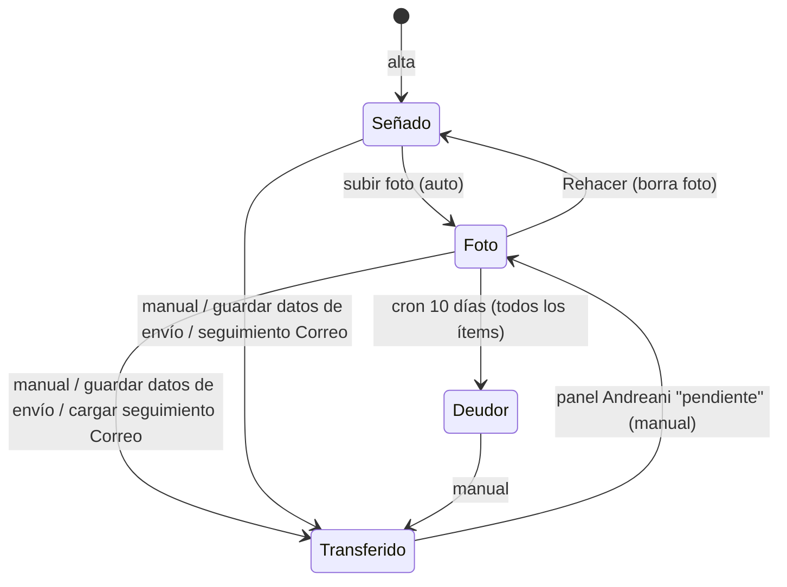

# Máquina de estados — Venta (`sellos.estado_venta`, `ordenes.estado_orden`)

Valores ítem (CHECK): `Señado`, `Foto`, `Transferido`, `Deudor` (nulo = Señado).
Valores orden (CHECK): los anteriores + legados `Hecho`, `Hacer Etiqueta`, `Etiqueta Lista`, `Despachado`, `Seguimiento Enviado`.

| Estado | Significa | Entrada | Efectos / habilita |
|---|---|---|---|
| `Señado` | El cliente pagó la seña ($20.000; $30.000 XL/web) | ✅ Alta; Rehacer | Cola "Enviar foto" (si Hecho) |
| `Foto` ("Foto enviada") | Se le mandó la foto del sello terminado y se espera el pago | ✅ Subir foto | ✅ WhatsApp con restante; cola "Esperando pago"; pasa a Envíos → "Pendientes de datos"; reloj de 10 días para Deudor |
| `Transferido` | El cliente pagó todo (incluye envío salvo Andreani) | ✅ Ver arriba | Estado de envío editable; cola "Para enviar"; descarga de etiqueta Andreani; recompra a 2 meses |
| `Deudor` | No pagó 10 días después de la foto | ✅ Cron | ✅ Notificación v4; **sale de Envíos**; cola "Deudores" |

## Orden vs ítems

- `estado_orden` se sincroniza con los ítems **solo si todos coinciden** (BR-PED-003). Con ítems mixtos, queda el último valor uniforme.
- `mapOrdenToOrder` lee `estado_orden` para `saleStateOrder`; las celdas por ítem leen `estado_venta`.

## Control

- **DB**: solo el cron de deudores. Ninguna restricción impide, por ejemplo, `Transferido → Señado`.
- **UI**: la celda Venta solo se habilita si el ítem está `Hecho`.
- ✅ "Transferido" = el cliente pagó todo lo que debía, incluido el envío si correspondía; con Andreani el envío se paga en su web (Q-VEN-003). Los datos de envío se cargan solo después de este pago.
- Deudor: política deseada de recordatorio cada ~15 días, **no implementada** (POL-008).
