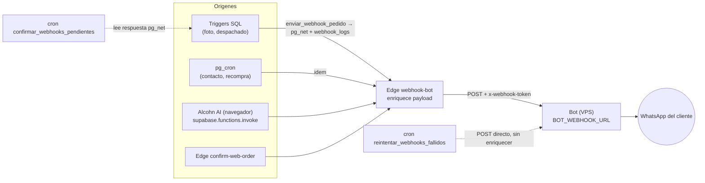

# Bot de WhatsApp

> ⚠️ El bot **no está en este repositorio**: corre en el VPS de Hetzner y envía usando **plantillas de Meta** (utilidad y marketing) cargadas por Julián. Hoy solo envía lo que dispara la app; hay un agente conversacional ("Francisco") **desactivado**. La conexión con Meta funciona aunque la app de Meta la muestre como no vinculada. Alcohn AI solo le envía webhooks. Edge: `supabase/functions/webhook-bot/index.ts` (v28, `verify_jwt=false`). SQL: `enviar_webhook_pedido`, `confirmar_webhooks_pendientes`, `reintentar_webhooks_fallidos`. Docs previas (raíz): `webhook.md`, `webhook_implementation_guide.md`, `bot_webhook_implementation.md`, `SOLUCION_WEBHOOKS_COMPLETA.md`.

## Para qué existe

✅ Enviar mensajes de WhatsApp a clientes en momentos clave: pedido registrado/actualizado, sello listo (foto + monto), pedido enviado (seguimiento), rehacer, mockups, contacto comercial, recompra. Catálogo en [04-business-rules/mensajes-al-cliente.md](../04-business-rules/mensajes-al-cliente.md).

## Flujo

## Entrada (contrato hacia la edge)

`{ numero_telefono, nombre, tipo_actualizacion, datos }`. Si `datos.numero_pedido` existe, la edge **enriquece**: ítems (nombre, tipo, medidas, valor, seña, saldo), totales de la orden, cliente, tipo de envío con etiqueta legible, imagen del ítem actual, ítems sin foto, reglas de cobro (ver abajo).

## Reglas de cobro (`pedido_listo`)

Ver [mensajes-al-cliente.md](../04-business-rules/mensajes-al-cliente.md#reglas-monto-pedido-listo). Incluye la **asignación del link de Andreani** del pool y la regla de **envío gratis con ≥3 sellos**.

## Salida y efectos

- Respuesta OK del bot: `success===true` o `mensaje_id`.
- Si el tipo es `pedido_enviado` y OK → la edge pasa la orden de `Despachado` a `Seguimiento Enviado`.
- Timeout hacia el bot: `BOT_WEBHOOK_TIMEOUT_MS` (default 120 s).

## Autenticación

- Edge ← llamadores: sin verificación de JWT (`verify_jwt=false`); los SQL envían el anon key en el header.
- Edge → bot: header `x-webhook-token` = secreto `WEBHOOK_TOKEN` (obligatorio).
- **Reintentos SQL → bot**: POST **directo** a la URL del bot (hardcodeada en la función SQL, HTTP sin TLS), **sin** token ni enriquecimiento.

## Registro y reintentos

`webhook_logs` (94.943): `success` nulo → confirmado por cron cada 2 min (sin respuesta 15 min = fallo) → reintento cada 5 min hasta 3 veces, solo dentro de la primera hora.

## Configuración

Secretos de la edge: `BOT_WEBHOOK_URL`, `WEBHOOK_TOKEN`, `BOT_WEBHOOK_TIMEOUT_MS`, `COSTO_ENVIO_SUCURSAL`, `COSTO_ENVIO_DOMICILIO`, `SUPABASE_SERVICE_ROLE_KEY`. Frontend: `VITE_ORDER_WEBHOOK_FUNCTION_NAME` (default `webhook-bot`).

## Riesgos observados

- Timeout de `pg_net` (15 s; 10 s en reintentos) vs edge que espera al bot hasta 120 s: un mensaje lento puede registrarse como fallido y **reintentarse** directo al bot → posibles duplicados. ✅ En los últimos 30 días, 30–50 % de los webhooks de cada tipo quedaron "fallidos", mayormente por timeout de 10 s. Hubo además un pico anómalo en junio–julio 2026 (~91.000 registros de contacto comercial). [AUD-UND-003](../audits/comportamientos-no-documentados.md#aud-und-003).
- URL del bot e IP del servidor escritas en código (edge default y SQL).
- El texto de cada mensaje vive en el bot y en las plantillas de Meta (Q-WA-002).
