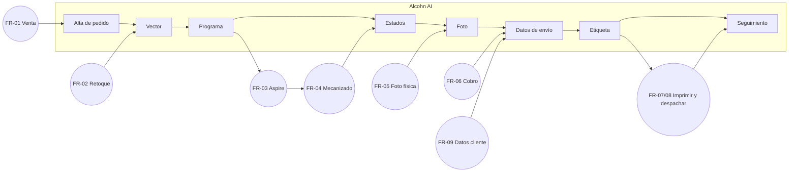

# Fronteras Alcohn AI ↔ mundo real

Alcohn AI acompaña procesos que siguen fuera del software. Cada frontera indica qué pasa **dentro** de la app (✅ código), y el **proceso externo confirmado por el equipo** (👥, 2026-09-28) o todavía desconocido (❓). Personas: ver [equipo](../01-product/equipo.md).

---

## FR-01 · Venta y acuerdo con el cliente

- **Dentro** ✅: registro del cliente, ítems, valor, seña, canal; WhatsApp `pedido_registrado`; cotización sugerida; generador de mockups.
- **Externo** 👥: la venta se conversa por **WhatsApp** (casi todo), Instagram, Facebook o la web. La **seña es obligatoria** para tomar un trabajo: $20.000 (WhatsApp), $30.000 en sellos XL y en la web. El cliente manda el comprobante por WhatsApp. Ventas: Cachi y Juli B (a veces Julián).
- Para mostrar el diseño rápido, Ventas usa el **generador de mockups** en lugar de Photoshop y le manda la muestra con medidas y precios al cliente cuando se confirma.
- **Pendiente** ❓: cómo se verifica que la seña ingresó (¿quién mira la cuenta?).

## FR-02 · Retoque de imagen y vectorización manual

- **Dentro** ✅: base mejorada desde el portapapeles, vectorización con Vectorizer.AI, subida manual de vectores.
- **Externo** 👥: el retoque de la imagen se hace **con IA, en general ChatGPT**. Los casos difíciles o especiales se vectorizan **a mano en Illustrator** (lo decide quien hace el vector). El "programa de escritorio" anterior ya no se usa. Vectoriza Fede.

## FR-03 · Armado del programa en Aspire

- **Dentro** ✅: gadget que baja el programa, importa, ubica, recalcula, reporta y sube el `.crv3d`.
- **Externo** 👥: hay **dos PCs, una por CNC**. Fede arma los programas y corre el gadget **siempre con internet** (la subida manual del `.crv3d` se evita). Fede mantiene los `.crv3d` base.
- **Pendiente** ❓: relación entre las 2 CNC físicas y las 3 máquinas del sistema ([Q-CNC-007](../14-open-questions/produccion-fabricacion.md#q-cnc-007)).

## FR-04 · Mecanizado, prueba y armado

- **Dentro** ✅: estados `Haciendo`/`Hecho`/`Retocar`/`Rehacer`/`Verificar`, consumo teórico de bronce, tiempo estimado (guardado, no mostrado).
- **Externo** 👥:
  - Las **trayectorias se guardan a mano en un pendrive** y se llevan a la máquina (objetivo futuro: subirlas a la app y descargarlas logueado en la PC de la CNC).
  - **Un programa por día por máquina**: Chica ~24 h de corrida; Grande 10–12 h o menos.
  - Las planchuelas llegan cortadas; si falta material se compra en Buenos Aires (2–3 días).
  - Fede marca **Haciendo** cuando deja la máquina corriendo y **Hecho** cuando cortó los sellos, los sacó y **los probó en cuero**.
  - **Retocar**: detalle corregible sin rehacer. **Verificar**: Producción no está segura y lo deja para que Ventas lo chequee.
  - El **armado del sello** (varilla M6 de 130 mm con tuerca, mango de madera enroscado, prisionero pegado) lo hace **Cachi al momento de hacer el envío**.
  - Abecedarios: en la **Grande**, en un programa especial armado a mano. Soldadores: adaptados a mano (corte de punta + rosca M6). Bases y mangos de golpe vienen hechos.
- **SOP**: [fabricar-un-sello.md](../11-operations-sops/fabricar-un-sello.md).

## FR-05 · Foto del sello terminado

- **Dentro** ✅: subir foto → `Foto` → WhatsApp con foto y monto.
- **Externo** 👥: **Juli B** saca las fotos **por ítem** y las sube; la automatización se las envía a cada cliente. ❓ Estándar visual (fondo, si es la pieza o la marca en cuero): sin definir.

## FR-06 · Cobro y verificación de pagos

- **Dentro** ✅: estados de venta, confirmar pago web, cajas en Economía, cargos de rehacer.
- **Externo** 👥: cobran Juli B y Cachi; el cliente paga por transferencia y manda el comprobante. **Transferido** = pagó todo (incluido envío, salvo Andreani que se paga en su web). Los datos de envío se cargan recién cuando pagó. Las cajas de Economía se actualizan a mano y hoy están desactualizadas.
- **Pendiente** ❓: recordatorio a deudores cada ~15 días (deseado, no implementado).

## FR-07 · Etiqueta y despacho por Correo Argentino

- **Dentro** ✅: datos validados, subida y pago automáticos en MiCorreo, PDF enriquecido 100×152, `Despachado` → WhatsApp → `Seguimiento Enviado`.
- **Externo** 👥 (Cachi):
  1. Descarga el PDF de etiquetas del portal MiCorreo (hace un chequeo manual; se podría automatizar, no es urgente).
  2. **Lo sube en "Cargar seguimientos" justo antes de ir al correo** → así se marca Despachado y se le envía el seguimiento al cliente. La app se usa también para llevar el PDF al formato correcto y agregarle los íconos de los sellos.
  3. Imprime en **Zebra ZD220**, papel **100×152**.
  4. Arma los sellos y embala en **tubos** (las medidas declaradas en el CSV son las de esos tubos).
  5. Lleva los paquetes a la **Sucursal 5 de Mar del Plata (calle Sarmiento)**.
- Si cambian los datos con la etiqueta pagada: se **cancela** en MiCorreo y reintegran el dinero.
- **SOP**: [preparar-un-envio.md](../11-operations-sops/preparar-un-envio.md).

## FR-08 · Andreani

- **Dentro** ✅: pool de links, envío del link con la foto, sincronización de etiquetas y tracking, PDF unido, `Despachado` según el portal.
- **Externo** 👥: los **vendedores generan links antes de mandar las fotos**; el túnel en la PC de la oficina lo abre quien lo necesita (Julián o un vendedor) porque el VPS está en Alemania. Un link deja de funcionar pasado un tiempo (por eso las 30 h). El cliente completa y paga el envío en Andreani; **no se despacha hasta que pague**. Despacho desde la sucursal **Independencia (central de Mar del Plata)**. En Andreani las etiquetas se traen de su página **después** de despachar, por eso "Despachado" llega más tarde que en Correo.

## FR-09 · Obtener los datos de envío del cliente

- **Dentro** ✅: formulario con parseo de texto e IA, validación contra padrón.
- **Externo** 👥: Correo → se le manda al cliente un **mensaje estándar** pidiendo los datos; Andreani → el cliente los completa en el link. ❓ El texto del mensaje estándar no está documentado.

## FR-10 · Retiro en persona y Vía Cargo

- **Dentro** ✅: se eligen en el pedido; no tienen automatización.
- **Externo** 👥: se marcan a mano. Retiro: el cliente lo viene a buscar. Vía Cargo: se manda como encomienda copiando los datos a mano (Vía Cargo no tiene sistema).

## FR-11 · Compras e insumos

- **Dentro** ✅: stock de 15 insumos, descuento al despachar, tareas de reposición.
- **Externo** 👥: planchuelas desde Buenos Aires (2–3 días). Controlar stock de **bronce y packaging** es el próximo paso deseado. ❓ Proveedores y quién compra cada insumo.

## FR-12 · Conversación posterior a los mensajes automáticos

- **Dentro** ✅: la app dispara los mensajes y registra si el bot los aceptó.
- **Externo** 👥: el bot corre en Hetzner y usa **plantillas de Meta** (utilidad y marketing) cargadas por Julián. Por ahora **solo envía** los webhooks de la app: existe un agente conversacional ("Francisco") **desactivado** hasta ajustarlo. Las respuestas de los clientes las atiende el equipo en WhatsApp.

## FR-13 · Administración de usuarios e infraestructura

- **Externo** 👥: Julián administra el VPS (bot, workers, nginx) **sin backups ni monitoreo**; Vercel (frontend y `/api`); Supabase; aprueba usuarios desde Supabase. No hay proceso de baja de usuarios. Los cambios se hacen con Cursor/Claude: algunos se prueban en local y otros van directo a GitHub/producción (**no hay staging**).

## FR-14 · Abecedarios y accesorios

- 👥 Abecedario: máquina Grande, programa especial manual. Soldadores: adaptación manual. Bases y mangos de golpe: vienen hechos. Ver FR-04.
