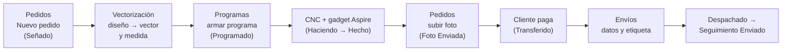

# Manual de uso de Alcohn AI

Manual para el equipo de Alcohn: qué hay en cada pantalla, para qué sirve cada botón y cómo se hacen las tareas del día a día. Está escrito para quien usa la app, no para quien la programa.

> Si algo de este manual no coincide con lo que ves en la app, avisale a Julián: o cambió la app o hay que corregir el manual.

## Índice

| # | Pantalla | Para qué sirve | La usan sobre todo |
|---|---|---|---|
| 1 | [Primeros pasos](01-primeros-pasos.md) | Entrar, el menú, notificaciones, novedades, tareas | Todos |
| 2 | [Inicio](02-inicio.md) | Tu resumen del día: metas, tareas, sellos listos, stock a reponer | Todos |
| 3 | [Pedidos](03-pedidos.md) | Cargar pedidos, seguir cada sello, fotos, cobros, seguimientos, rehacer | Ventas, Logística |
| 4 | [Vectorización](04-vectorizacion.md) | Pasar el diseño del cliente a vector y confirmar la medida | Producción |
| 5 | [Programas](05-programas.md) | Armar los programas de la CNC y seguirlos con el gadget de Aspire | Producción |
| 6 | [Producción](06-produccion.md) | Tabla de todos los sellos para fabricar | Producción |
| 7 | [Envíos](07-envios.md) | Datos de envío, etiquetas de Correo y Andreani, despachos | Logística, Ventas |
| 8 | [Stock](08-stock.md) | Insumos, reposición, consumo de bronce | Logística, Producción |
| 9 | [Mockups](09-mockups.md) | Mostrarle al cliente cómo queda su diseño marcado | Ventas |
| 10 | [Comercial Web](10-comercial-web.md) | Pedidos y contactos que llegan de la tienda web | Ventas |
| 11 | [Innovación](11-innovacion.md) | Tablero de proyectos e ideas | Todos |
| 12 | [Precios](12-precios.md) | Lista de precios | Julián |
| 13 | [Economía y Gastos](13-economia-y-gastos.md) | Números del negocio | Julián |
| 14 | [Configuración y WhatsApp Bot](14-configuracion-y-whatsapp.md) | Quién recibe cada aviso; conexión con Meta | Julián |
| 15 | [Problemas frecuentes](15-problemas-frecuentes.md) | Qué hacer cuando algo no sale | Todos |
| 16 | [Centro Alcohn](16-centro-alcohn.md) | Manual, búsqueda y asistente dentro de la app | Todos |
| 17 | [Errores](17-errores.md) | Rehaceres: métricas y archivos congelados del error | Producción, Ventas |

## Lo básico que hay que entender

### Pedido e ítem

- Un **pedido** es una compra de un cliente. Tiene un solo envío.
- Cada pedido tiene uno o más **ítems**. Un ítem puede ser un **sello**, un **abecedario**, un **soldador**, un **mango de golpe** o una **base para remachadora**.
- Casi todo se sigue **por ítem**: cada sello se fabrica, se fotografía y se cobra por separado. El **envío** se sigue **por pedido**.

En la app, a los ítems muchas veces se los llama "sellos", aunque sean accesorios.

### Los tres estados de cada ítem

Cada ítem tiene tres estados que avanzan en paralelo. Entenderlos es entender la app.

**1. Fabricación** (lo maneja Producción)

| Estado | Qué significa |
|---|---|
| **Sin Hacer** | Todavía no se fabricó ni está en un programa |
| **Programado** | Está en un programa de la CNC, esperando ser fabricado |
| **Haciendo** | La máquina quedó corriendo con ese sello |
| **Hecho** | Se cortó, se sacó de la máquina y **se probó en cuero** |
| **Verificar** | Producción no está segura de que haya salido bien y le pide a Ventas que lo revise |
| **Retocar** | Salió un detalle mal que se corrige sin volver a fabricarlo |
| **Rehacer** | Hay que fabricarlo de nuevo (siempre se indica el motivo) |

**2. Venta** (lo maneja Ventas). Solo se puede cambiar cuando el ítem está **Hecho**.

| Estado | Qué significa |
|---|---|
| **Señado** | El cliente pagó la seña |
| **Foto Enviada** | Se le mandó la foto del sello terminado y se espera que pague el resto |
| **Transferido** | Pagó todo lo que debía (incluido el envío, salvo Andreani) |
| **Deudor** | Pasaron 10 días desde la foto y no pagó (lo marca la app sola) |

**3. Envío** (lo maneja Logística; es del pedido, no del ítem). Solo se puede cambiar cuando la venta está **Transferido**.

| Estado | Qué significa |
|---|---|
| **Sin Envío** | Todavía no se empezó el envío |
| **Hacer Etiqueta** | Hay que generar la etiqueta o se está generando |
| **Error de Etiqueta** | El correo rechazó los datos; hay que corregirlos |
| **Etiqueta Lista** | La etiqueta está hecha |
| **Despachado** | El paquete salió |
| **Seguimiento Enviado** | El cliente ya recibió su número de seguimiento. Fin del recorrido |

### El recorrido de un pedido por la app

| Paso | Quién | Dónde | Qué pasa solo |
|---|---|---|---|
| 1. Cargar el pedido con la seña | Ventas | [Pedidos → Nuevo](03-pedidos.md#cargar-un-pedido-nuevo) | Al cliente le llega un WhatsApp confirmando el pedido |
| 2. Vectorizar y confirmar medida | Producción | [Vectorización](04-vectorizacion.md) | — |
| 3. Armar el programa | Producción | [Programas](05-programas.md) | El sello pasa a Programado |
| 4. Fabricar | Producción | CNC + gadget de Aspire | El programa se sincroniza con la app |
| 5. Marcar Hecho | Producción | Programas o Producción | Ventas recibe un aviso |
| 6. Sacar y subir la foto | Ventas | [Pedidos → Subir Fotos](03-pedidos.md#subir-fotos-de-sellos-terminados) | Al cliente le llega la foto con el monto que falta pagar. A los 10 días sin pago pasa a Deudor |
| 7. Confirmar el pago | Ventas | Pedidos o Envíos | — |
| 8. Cargar datos de envío y hacer la etiqueta | Logística | [Envíos](07-envios.md) | Con Correo Argentino la etiqueta se genera sola en MiCorreo |
| 9. Despachar | Logística | [Pedidos → Subir seguimientos](03-pedidos.md#cargar-los-seguimientos-antes-de-ir-al-correo) | Al cliente le llega el número de seguimiento y se descuenta el stock |

### Mensajes automáticos al cliente

La app le manda WhatsApp al cliente en estos momentos. **No hace falta mandarlos a mano**, y conviene saber cuándo salen para no duplicarlos:

| Cuándo | Mensaje |
|---|---|
| Se crea el pedido (salvo que marques no avisar) | Confirmación del pedido |
| Se agrega o se quita un ítem de un pedido | Pedido actualizado |
| Se sube la foto de un ítem | Foto del sello terminado y cuánto falta pagar |
| Un ítem pasa a Rehacer | Aviso de que se va a rehacer (siempre, por transparencia) |
| El pedido pasa a Despachado con número de seguimiento | Número y link de seguimiento |
| Mockup pedido desde la web, recompra a los 2 meses | Mensajes comerciales automáticos (ver [Comercial Web](10-comercial-web.md)) |

## Cómo está escrito este manual

- Los nombres de botones, pestañas y estados van en **negrita**, tal como aparecen en la app.
- ⚠️ marca cosas que conviene no olvidar o que pueden causar un problema.
- 🤖 marca algo que la app hace sola.
- Para el detalle técnico de cada pantalla (reglas, datos, código) está la [documentación del sistema](../README.md).
