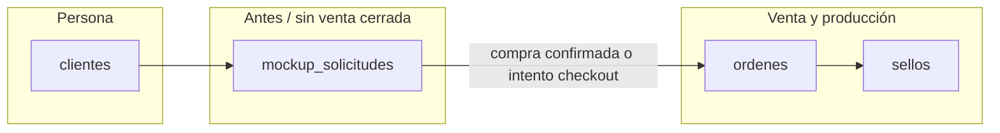
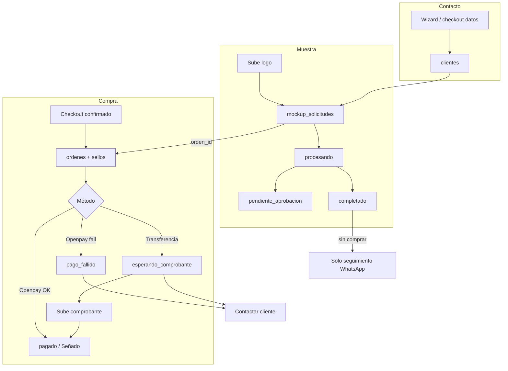

# Modelo de datos: Web Alcohn ↔ Supabase (app compartida)

Documento de referencia para conectar la tienda web con el **mismo proyecto Supabase** que usa la app interna. Resume decisiones de arquitectura, tablas, flujos y campos sugeridos.

---

## 1. Proyecto Supabase

| Decisión | Detalle |
|----------|---------|
| **Un solo proyecto** | Mismo Supabase que la app → las ventas y los intentos aparecen donde el equipo ya trabaja. |
| **Escritura desde la web** | Siempre vía **API routes de Next.js** con `SUPABASE_SERVICE_ROLE_KEY` (nunca crear pedidos sensibles desde el navegador con anon key). |
| **Variables de entorno** | `NEXT_PUBLIC_SUPABASE_URL`, `SUPABASE_SERVICE_ROLE_KEY` (servidor). |

El catálogo (diseños estándar, FAQs, páginas) sigue en código (`/src/data`). Supabase es para **personas, muestras, pedidos, archivos y pagos**.

---

## 2. Tablas y responsabilidades

| Tabla | Rol |
|-------|-----|
| **`clientes`** | Cualquier persona que dejó datos de contacto (web, WhatsApp, etc.). Incluye quien **no compró**. |
| **`mockup_solicitudes`** | Cada intento de **muestra / wizard** (logo, mockups, revisión). La compra puede ser días después o nunca. |
| **`ordenes`** | Cabecera del pedido cuando hay **intento o confirmación de compra** (checkout). |
| **`sellos`** | Ítems del pedido (en el esquema actual no hay `order_items`; cada línea es un sello). |
| **`direcciones`** | Envío, cuando el checkout lo complete. |
| **Storage** | Logos, mockups, comprobantes de transferencia. |

### Qué NO hacer

- **No** usar columna `compro` en `clientes` → se desactualiza. Mejor: “compró” = tiene `ordenes` relevantes o `mockup.orden_id` completado.
- **No** tabla `leads` separada al inicio (salvo CRM de marketing más adelante).
- **No** crear `ordenes` + `sellos` solo por navegar o por tener mockup listo **sin** pasar por checkout (evita ruido y triggers de fabricación).
- **No** duplicar el wizard en otra tabla; `mockup_solicitudes` ya modela la muestra.

---

## 3. Cuándo crear cada registro

| Momento | Acción |
|---------|--------|
| Solo navega la web | Nada en BD |
| Completa **contacto** del wizard o checkout | **Upsert `clientes`** (`medio_contacto = 'Web'`, upsert por `telefono`) |
| Sube logo / inicia muestra | **INSERT `mockup_solicitudes`** (`estado: procesando`) |
| Mockup listo o en revisión | **UPDATE mockup** → `completado` o `pendiente_aprobacion` |
| Confirma datos en **checkout** | **INSERT `ordenes` + `sellos`** (intento de compra) + enlazar `mockup.orden_id` si viene del wizard |
| Pago tarjeta OK | UPDATE orden → pagado / `estado_orden` operativo (ej. `Señado`) |
| Pago tarjeta falla | UPDATE orden → `pago_fallido` + mensaje |
| Elige **transferencia** | Orden en `esperando_comprobante` |
| Sube comprobante | Storage + columnas en orden |
| App valida transferencia | Pasar a pagado / `Señado` |

### Mapeo web → `clientes`

- `clientes` exige `nombre`, `apellido`, `telefono`.
- Partir el nombre del formulario o usar apellido placeholder si hace falta.
- `mail`: solo si lo escribió; usar `NULL` (no `""`) por UNIQUE.
- `medio_contacto`: valor permitido `'Web'`.

---

## 4. Embudo: wizard → compra (opcional)

El wizard de personalizados y la compra son **dos tiempos**:

1. **Muestra** (wizard completo, mockup, precio).
2. **Compra** (carrito + checkout + pago), puede no ocurrir.

### Quien hizo muestra y no compró

- `clientes` + `mockup_solicitudes` con mockup terminado.
- `mockup_solicitudes.orden_id` **NULL**.
- Lista para seguimiento por WhatsApp (remarketing).

### Quien intentó comprar y no cerró

- `ordenes` con `estado_pago_web` pendiente / fallido / esperando comprobante.
- Opcional: `checkout_iniciado_at`, `carrito_json` en la orden o en el mockup enlazado.

### Mismo cliente, varias veces

- Un `clientes` (mismo teléfono).
- Varias `mockup_solicitudes` (un logo distinto por intento).
- Cero o varias `ordenes` en el tiempo.

---

## 5. Revisión de diseño: ¿dónde guardar?

| Situación | Dónde |
|-----------|--------|
| **Antes de pagar** (logo complejo, muestra manual) | `mockup_solicitudes` → `pendiente_aprobacion` → `completado`. **No** `ordenes`/`sellos` todavía. |
| **Después de pagar** (retoque, vector, verificar) | `ordenes` + `sellos` (`nota`, `archivo_base`, `estado_fabricacion`, `estado_vectorizacion`). |

`mockup_solicitudes` es el pipeline que la app ya usa para generar mockups. La web debería alimentar la misma tabla.

---

## 6. Errores de compra (tarjeta / Openpay)

**Objetivo:** registrar el intento para escribir por WhatsApp y retomar la venta.

### Flujo recomendado

1. Usuario confirma checkout → crear **`cliente` + `orden` + `sellos`** con pago pendiente.
2. Redirige a Openpay.
3. **Success** → marcar pagado; `estado_orden` acorde a la app (ej. `Señado`).
4. **Failed** (`/checkout/openpay/failed`) → API actualiza la misma orden: `estado_pago_web = pago_fallido` + código/mensaje de error.

La orden debe identificarse por `orden_id` en la URL o sesión, **no** depender solo del carrito en `localStorage`.

### Campos sugeridos en `ordenes`

| Campo | Uso |
|-------|-----|
| `origen` | `'Web'` |
| `metodo_pago` | `'Openpay'` \| `'Transferencia'` |
| `estado_pago_web` | Ver sección 8 |
| `pago_error_codigo` / `pago_error_mensaje` | Detalle del fallo |
| `openpay_order_id` | Referencia externa |
| `ultimo_intento_pago_at` | Timestamp |

---

## 7. Pago por transferencia y comprobante

**Objetivo:** quedar registrado desde que confirman el pedido; el comprobante es obligatorio para validar.

### Flujo

1. Elige transferencia y confirma → `ordenes` + `sellos`, `metodo_pago = Transferencia`, `estado_pago_web = esperando_comprobante`.
2. Cliente sube archivo → **Storage** (bucket `comprobantes`) + `comprobante_path` / `comprobante_url` + `comprobante_subido_at` en la orden.
3. Equipo valida en la app → `estado_pago_web = pagado` y `estado_orden = Señado` (o el flujo que ya usen).

Si solo mandan WhatsApp sin archivo, la orden sigue en `esperando_comprobante` y se puede pedir el comprobante.

### Campos sugeridos

| Campo | Uso |
|-------|-----|
| `comprobante_path` o `comprobante_url` | Archivo subido |
| `comprobante_subido_at` | Cuándo lo subió |
| `comprobante_validado_por` / `comprobante_validado_at` | Opcional, validación interna |

---

## 8. Estados de pago web (`estado_pago_web`)

Propuesta de valores **separados** de `estado_orden` / envío (para no romper la lógica actual de producción):

| Valor | Significado |
|-------|-------------|
| `pendiente` | Checkout creado, aún no pagó |
| `pago_fallido` | Openpay o error de red; contactar por WhatsApp |
| `esperando_comprobante` | Transferencia elegida; falta o hay que validar comprobante |
| `pagado` | Pago confirmado (tarjeta o transferencia validada) |
| `abandonado` | Opcional: timeout sin actividad |

`estado_orden` sigue siendo el estado operativo de la app (`Señado`, `Hecho`, envíos, etc.) una vez el pago está confirmado.

---

## 9. Extensiones sugeridas en BD

### `mockup_solicitudes`

| Columna | Tipo | Notas |
|---------|------|--------|
| `cliente_id` | uuid FK → `clientes` | Quién es |
| `orden_id` | uuid FK → `ordenes`, nullable | Se completa al comprar |
| `checkout_iniciado_at` | timestamptz, nullable | Llegó al checkout |
| `carrito_json` | jsonb, nullable | Snapshot si abandona checkout |
| `origen` | text | `'web'` |

Estados actuales: `procesando`, `pendiente_aprobacion`, `completado`, `error`. Valor extra opcional: `listo_para_comprar` si hace falta distinguir en la UI.

### `ordenes`

| Columna | Tipo | Notas |
|---------|------|--------|
| `origen` | varchar | `'Web'` |
| `metodo_pago` | varchar | `Openpay`, `Transferencia` |
| `estado_pago_web` | varchar | Ver sección 8 |
| `pago_error_*`, `openpay_order_id` | text | Errores tarjeta |
| `comprobante_*` | text / timestamptz | Transferencia |
| `notas_web` | jsonb | Metadata libre |

### `sellos`

Usar **`item_config` (jsonb)** para metadata web sin muchas migraciones:

- `design_slug`, `material_web`, `origen`, URLs del wizard, id de `mockup_solicitud`, etc.

Copiar URLs relevantes a `archivo_base` / `diseno` cuando corresponda.

### Storage (mismo proyecto)

| Bucket | Contenido |
|--------|-----------|
| `logos` | Logo original / optimizado |
| `mockups` | Vistas previas |
| `comprobantes` | `{orden_id}/{timestamp}.ext` |

---

## 10. Vistas útiles en la app

| Vista | Filtro aproximado |
|-------|-------------------|
| **Muestra sin compra** | `mockup.estado IN ('completado','pendiente_aprobacion')` AND `orden_id IS NULL` |
| **Pagos fallidos** | `origen = 'Web'` AND `estado_pago_web = 'pago_fallido'` |
| **Esperando comprobante** | `metodo_pago = 'Transferencia'` AND `estado_pago_web = 'esperando_comprobante'` |
| **Comprobante recién subido** | `comprobante_subido_at` reciente |

Acción típica: botón “WhatsApp” usando `clientes.telefono`.

---

## 11. Diagrama completo

---

## 12. Implementación en la web (checklist)

- [ ] Dependencia `@supabase/supabase-js` + cliente admin en servidor.
- [ ] `POST /api/clientes/upsert` — al pasar ContactStep o checkout paso 1.
- [ ] `POST /api/mockups` — crear/actualizar solicitud al subir logo y al terminar mockup.
- [ ] `POST /api/checkout/intent` — crear `ordenes` + `sellos` al confirmar checkout.
- [ ] `PATCH /api/orders/:id/payment` — fallo Openpay, success, transferencia.
- [ ] `POST /api/orders/:id/receipt` — subir comprobante a Storage.
- [ ] Páginas Openpay success/failed llaman a la API con `orden_id`.
- [ ] Enlazar `mockup_solicitudes.orden_id` al crear la orden.
- [ ] Ajustar app interna: filtros y pantallas para estados web (migración + CHECK si aplica).

---

## 13. Referencia de esquema actual

Definiciones SQL de tablas existentes: [`supabase_schema.md`](../supabase_schema.md) en la raíz del repo.

---

## 14. Resumen en una frase

**`clientes`** guarda a todos los contactos; **`mockup_solicitudes`** guarda cada muestra del wizard (compre o no); **`ordenes` + `sellos`** guardan cada intento o venta de checkout, con **`estado_pago_web`** y comprobante para transferencias y fallos de tarjeta — todo en el mismo Supabase que la app.
